# Lab 2: Introduction to LLMs and Azure AI Services

## Lab Scenario

Participants will set up an AI project and hub, deploy Azure OpenAI models, and integrate content safety services. They will use the Azure AI Foundry Playground to test models, work with open-source LLMs, and create and manage prompt flows, ensuring safe and effective AI interactions.

## Lab Objectives
After completing this lab, you will be able to complete the following tasks:

- Task 1: Create an AI Project and AI Hub Resources
- Task 2: Deploy Azure OpenAI Models
- Task 3: Create a Content Safety Service
- Task 4: Add an Azure Content Safety connection
- Task 5: Use Azure AI Foundry Playground
- Task 6: Work with an Open Source LLM Model
- Task 7: Test the prompt in Content Safety
- Task 8: Create a Prompt Flow

### Estimated Duration: 60 minutes

## Task 01: Create an AI Project and AI Hub Resources

1. Open a new tab in the browser. Navigate to https://ai.azure.com to create a project in **Azure AI Foundry**.

   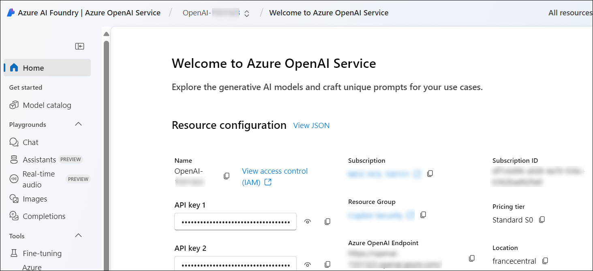

   >**Note:** If prompted to sign in, use the below credentials:
   >- **Email/Username:** <inject key="AzureAdUserEmail"></inject> and **Password:** <inject key="AzureAdUserPassword"></inject> 

1. Select **Azure AI Foundry** from the top-left corner.

   

1. Click on **+ Create project** to create a new project and hub.

   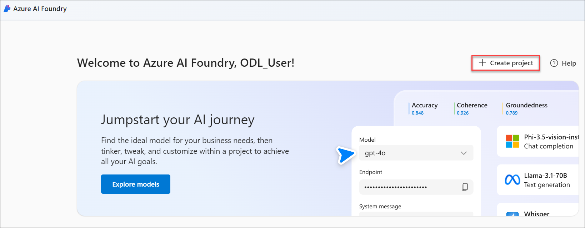

1. On the **Create a project** page, enter the below details:

   - **Project name**: openai-<inject key="DeploymentID" enableCopy="false"/>
   - Select **Customize**
   - **Hub name (1)**: **odl_user_<inject key="DeploymentID" enableCopy="false"/>_ai**
   - **Subscription (2)**: **Select your Default Subscription**
   - **Resource group (3)**: **AzureAIrg**
   - **Location (4)**: **EAST US**
   - **Connect Azure AI Service or Azure OpenAI (5)**: **(new)ai-odl-user_<inject key="DeploymentID" enableCopy="false"/>_ai**

      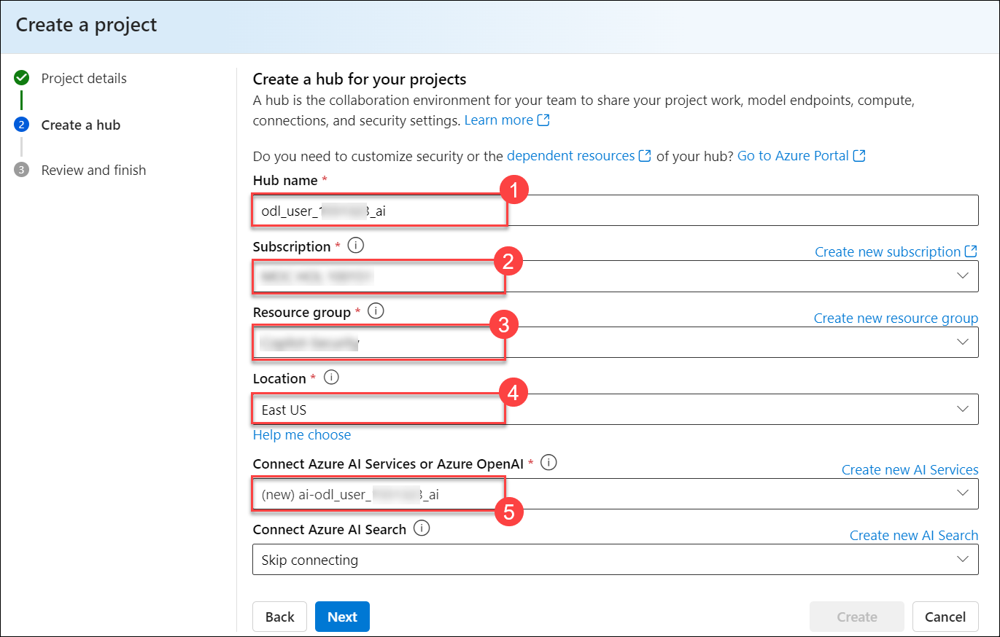

1. Click on **Create new AI Search (1)** for the **Connect Azure AI Search** option. Enter the name **ai-search-odl-user-<inject key="DeploymentID" enableCopy="false"/>-ai (2)** for your **Azure AI Search** and click on **Next (3)**.

   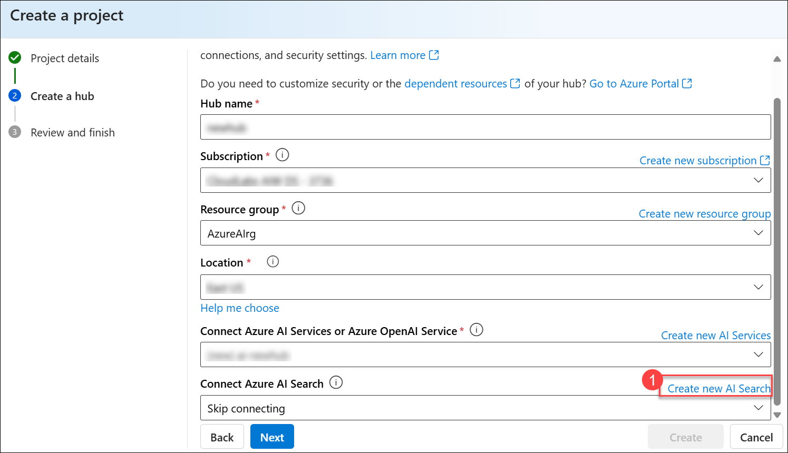

   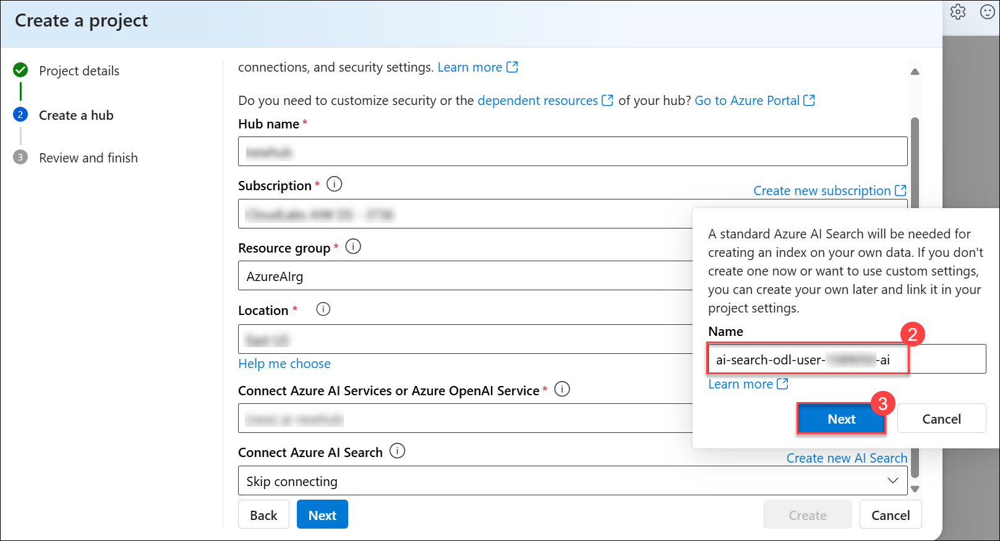

1. Select **Next**. In the **Review and finish** section, review your Azure AI services, click on **Create** and wait for the deployments to succeed.

   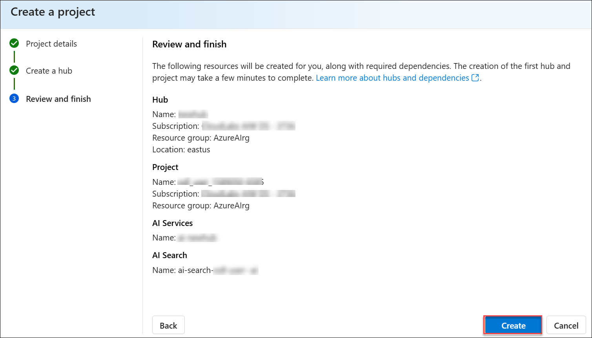

1. You can also navigate to your Resource group **AzureAIrg** section in the Azure portal to verify the resources deployed.

   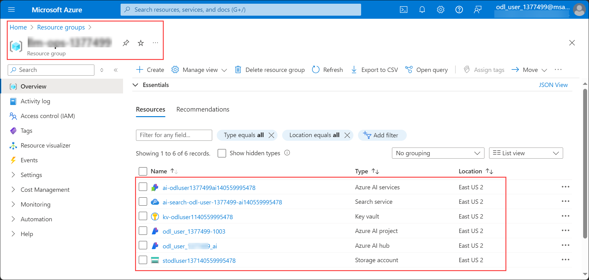

1. Within the selected **resource group**, in the left-hand menu, click on **Access control (IAM)**.

   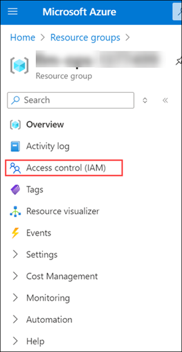

1. In the **Access Control (IAM)** pane, click on the **+ Add** button at the top.

1. Select **Add role assignment** from the drop-down.

1. In the **Add role assignment** pane, under **Role** tab, select **Reader** and click on **Next**. This role allows the user or entity to view all resources in the **resource group** but won't make any changes.

1. Under the **Assign access to** section, select **Managed identity (2)**.

1. Click on **+ Select members (3)**.

1. Select your **subscription (4)** under **Subscription** and select **Azure AI project (1) (5)** under **Managed identity**.

1. In the **Select** pane, search for and select the **specific project ID** or **managed identity associated with the AI project** you are working on **(6)**.

1. Once selected, click on **Select (7)** to confirm your choice.

1. Click on **Review + assign (8)** within the **Members** tab, and then click **Review + assign** again to complete the process.

   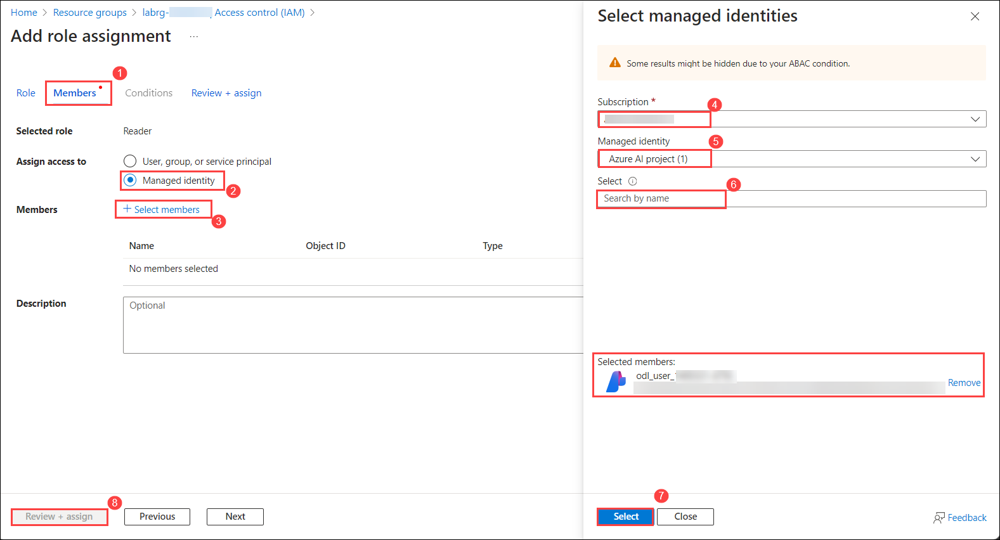

1. A notification will appear confirming that the role assignment has been successfully added.

   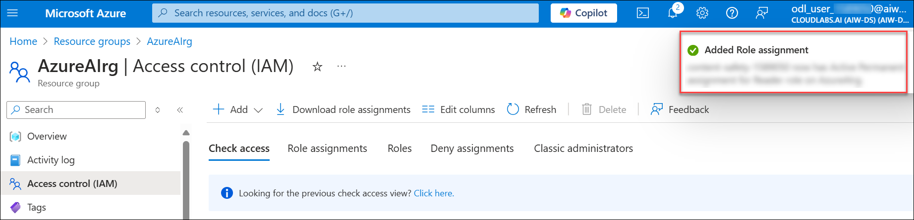

> **Congratulations** on completing the task! Now, it's time to validate it. Here are the steps:
> - Click on the **Validate** button for the corresponding task. If you receive a success message, you can proceed to the next task. 
> - If not, carefully read the error message and retry the step, following the instructions in the lab guide.
> - If you need any assistance, please contact us at **cloudlabs-support@spektrasystems.com**. We are available 24/7 to help you out.
 
<validation step="10d4fb5c-02d2-4573-a704-3f98f15bcd93" />

## Task 02: Deploy Azure OpenAI Models

1. Navigate back to the **Azure AI Foundry** portal, and open the project that you created.

1. From the left navigation pane, under **My assets** select **Model + endpoints (1)**. Click on **Deploy a model (2)** and select **Deploy base model (3)** to create an OpenAI model.

   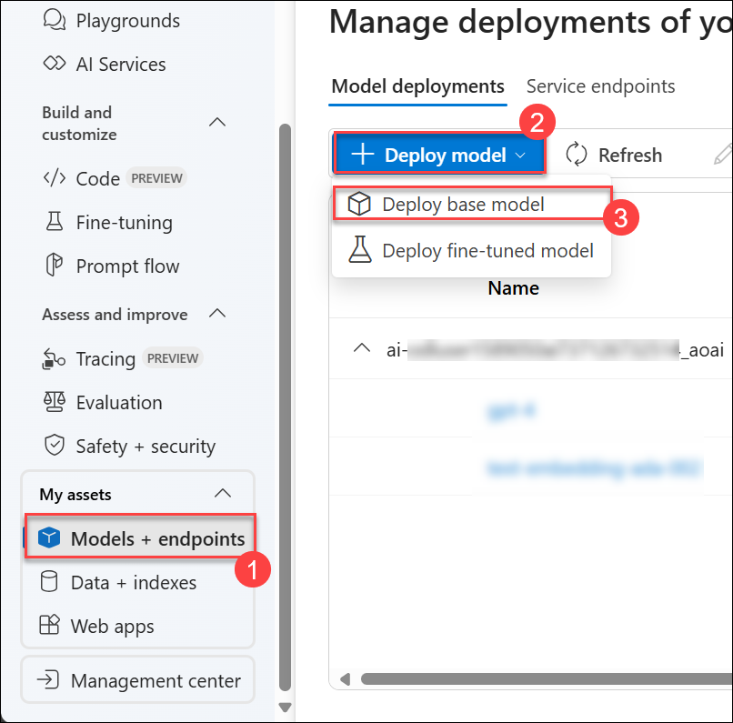

1. Select **gpt-4 (1)** from the list of models and click on **Confirm (2)**.

   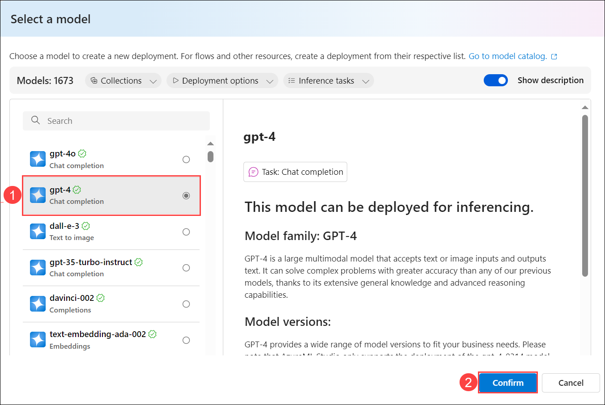

1. On the **Deploy model gpt-4** pane, click on **Customize**.

   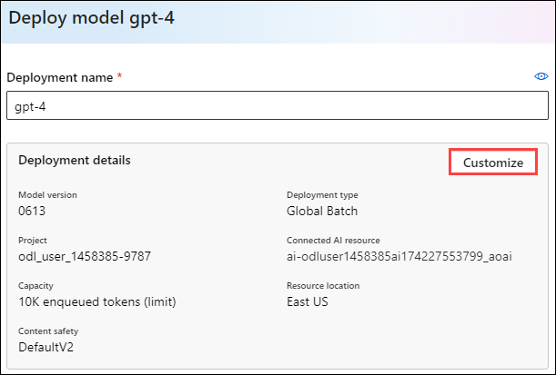

1. Provide the following details and click on **Deploy to selected resources**:

   - Deployment name: **gpt-4 (1)**
   - Deployment type: **Standard (2)**
   - Model version: **0125-Preview (3)**
   - Tokens per Minute Rate Limit: **10k (4)**
   - Select **Deploy**

     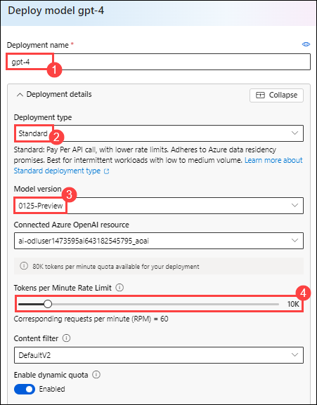
   
1. Verify that the **gpt-4** model is present in the **Model deployments** section.

   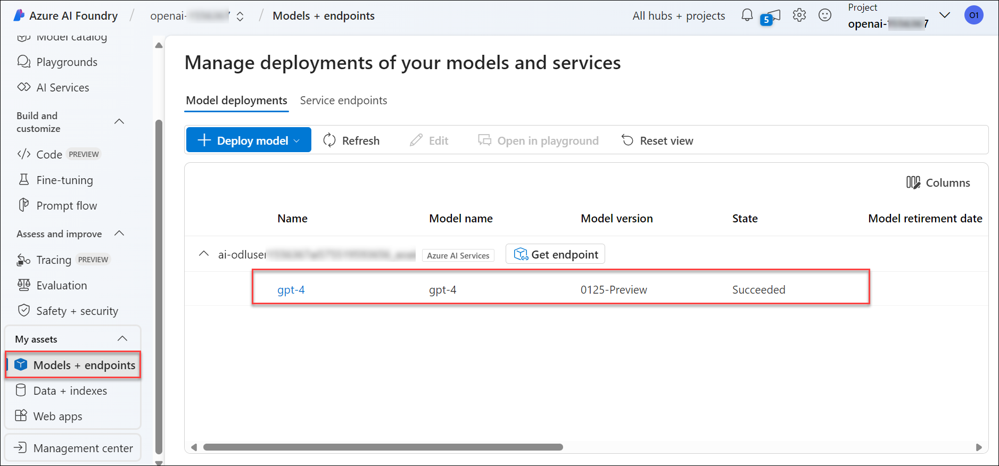

1. On the **Models + endpoints (1)** page, click on **Deploy a model (2)** and select **Deploy base model (3)** to create an OpenAI model.

   
   
1. Select **text-embedding-ada-002 (1)** from the list of models and click on **Confirm (2)**.

   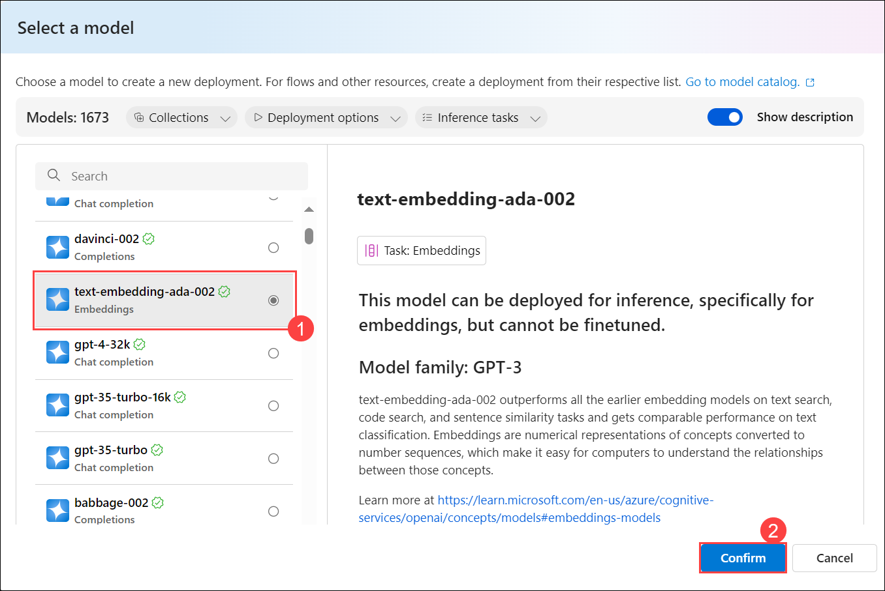

1. On the **Deploy model text-embedding-ada-002** pane, accept the default settings and click on **Deploy**.

   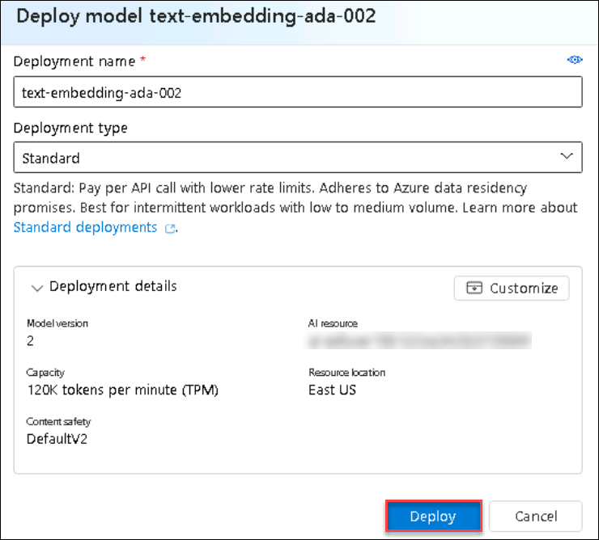

1. Verify that the **text-embedding-ada-002** model is present in the **Model deployments** section.

   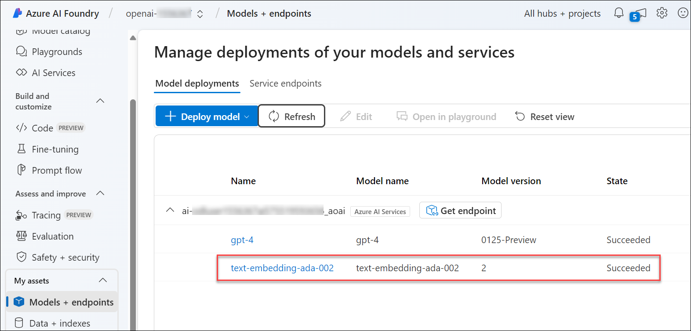

## Task 03: Create a Content Safety Service

1. Navigate to the **Azure portal** and search and select for **content safety**.

   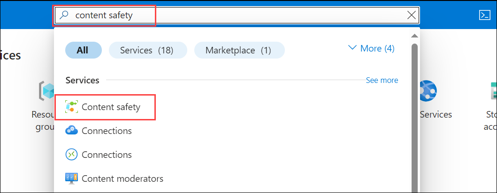

1. On the **Azure AI serices | Content safety** tab, click on **+ Create**.

1. On the **Create Content Safety** **Basics** tab, configure the following resources and click on **Next (6)**.

   >**Note:** Create the Content Safety resource in the same region where you have deployed the Azure AI services.

   - Subscription: **Select your Default Subscription (1)**
   - Resource group: **AzureAIrg (2)**
   - Region: **Enter the same RG, where Azure AI services is deployed (3)**
   - Name: **content-safety-<inject key="DeploymentID" enableCopy="false"/>(4)**
   - Pricing tier: **Standard S0 (5)**

       .png)

1. In the Network tab, leave the type settings as default, allowing access from all networks, including the Internet. Then, click **Next**.

      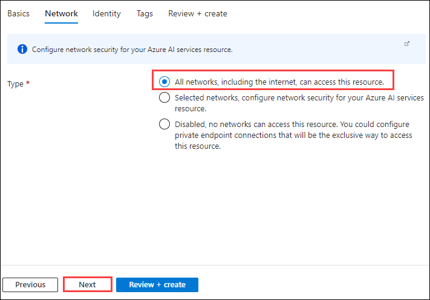
   
1. On the **Identity** tab, verify that the **System-assigned managed identity Status** is turned **On**. Click on **Review + create** and then on the **Create** option.

   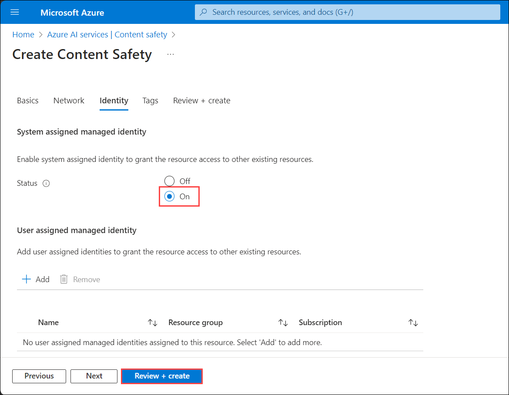

> **Congratulations** on completing the task! Now, it's time to validate it. Here are the steps:
> - Click on the **Validate** button for the corresponding task. If you receive a success message, you can proceed to the next task. 
> - If not, carefully read the error message and retry the step, following the instructions in the lab guide.
> - If you need any assistance, please contact us at **cloudlabs-support@spektrasystems.com**. We are available 24/7 to help you out.
 
<validation step="db0a4f63-f0c3-4d03-8575-019a239f7dad" />

## Task 04: Add an Azure Content Safety connection

1. Navigate to **Azure AI Foundry (1)**, select **openai-<inject key="DeploymentID" enableCopy="false"/> (2)** project. From the left navigation pane, scroll down, and select **Management center (3)**.

   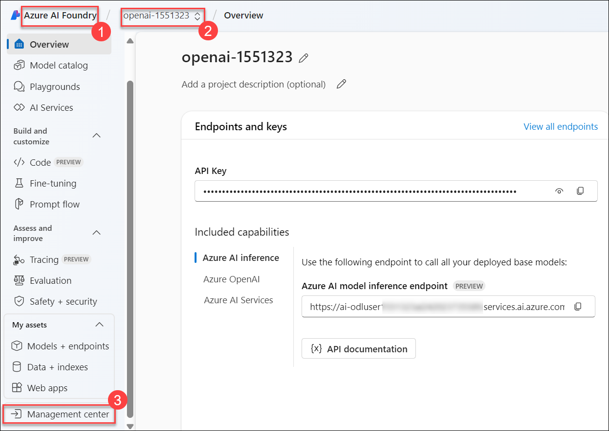

1. Under **Management center**, select **Connected resources (1)**. On the **Manage connected resources in this hub** page, click on **+ New connection (2)**.

   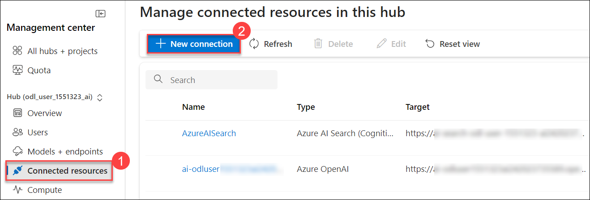

1. On the **Add a connection to external assets** pane, click on **Azure AI Content Safety**.

   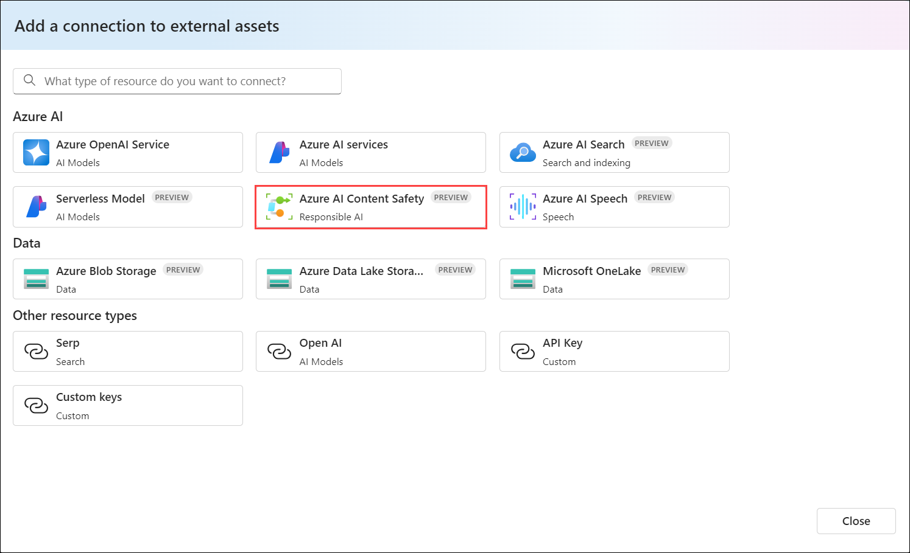

1. On the **Connect an Azure AI Content Safety resource** pane, click on **Add connection** for the existing Content Safety resource that you had created in the previous task.

   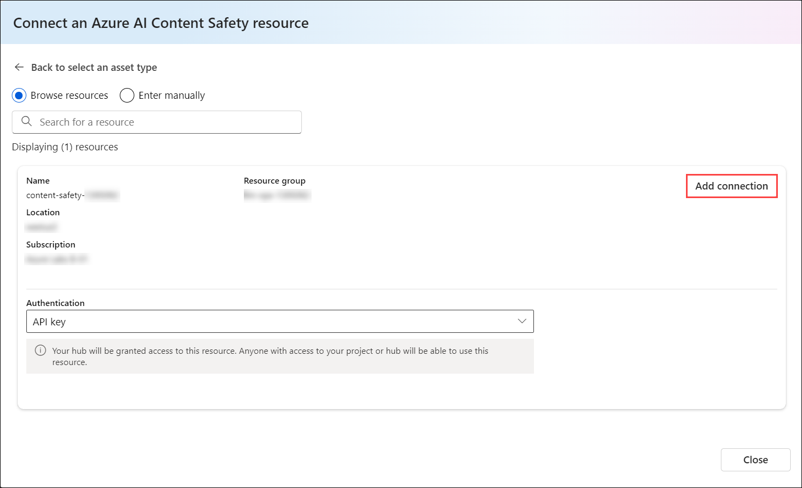

1. Once the status shows as **Connected**, click on **Close**.

   

1. Navigate back to **Connected resources** to verify the **Azure Content Safety connection**.

   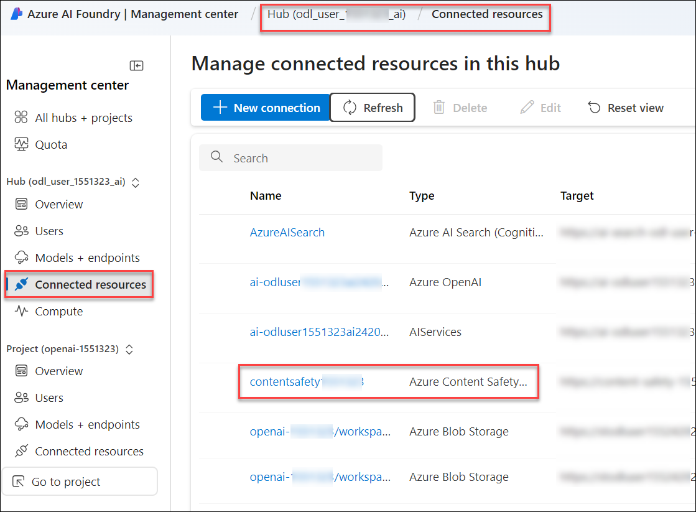

## Task 05: Use Azure AI Foundry Playground

1. From the left navigation pane, select **Go to project**.

   .png)

1. Under **My assets** select **Models + endpoints (1)**, navigate to the **gpt-4 (2)** deployment under the **Model deployments** section.

   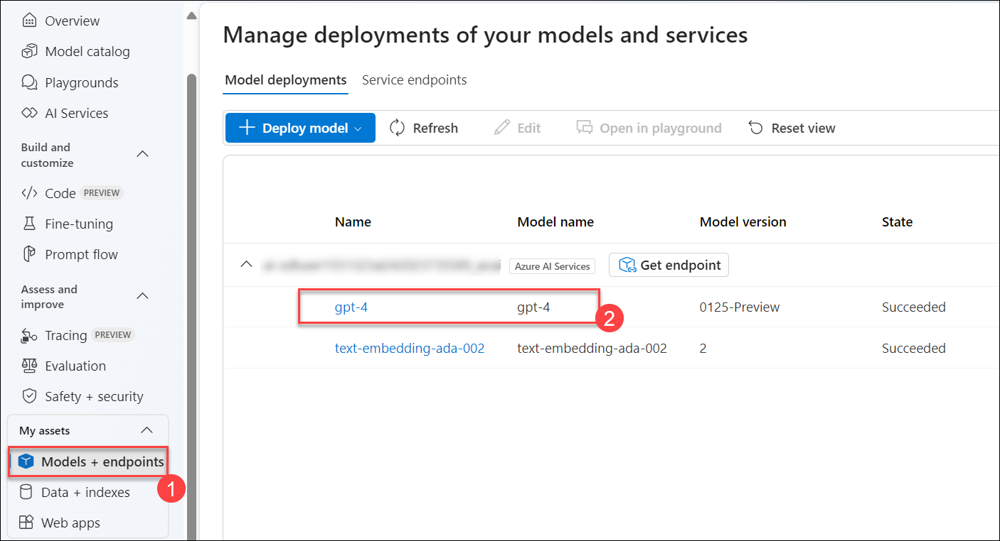

1. On the **gpt-4** deployment details, click on **Open in playground**.

   

1. Let us run an example where the model will help us summarize and extract information from a conversation between a customer and a representative of a telco company.

1. Copy and paste the following prompt into the **Give the model instructions and context** field of the **Chat playground** and click on **Apply changes**.

   ```
   You're an AI assistant that helps telco company to extract valuable information from their conversations by creating JSON files for each conversation transcription you receive. You always try to extract and format it as a JSON:
   1. Customer Name [name]
   2. Customer Contact Phone [phone]
   3. Main Topic of the Conversation [topic]
   4. Customer Sentiment (Neutral, Positive, Negative)[sentiment]
   5. How the Agent Handled the Conversation [agent_behavior]
   6. What was the FINAL Outcome of the Conversation [outcome]
   7. A really brief Summary of the Conversation [summary]

   Only extract information that you're sure of. If you're unsure, write "Unknown/Not Found" in the JSON file.
   ```

   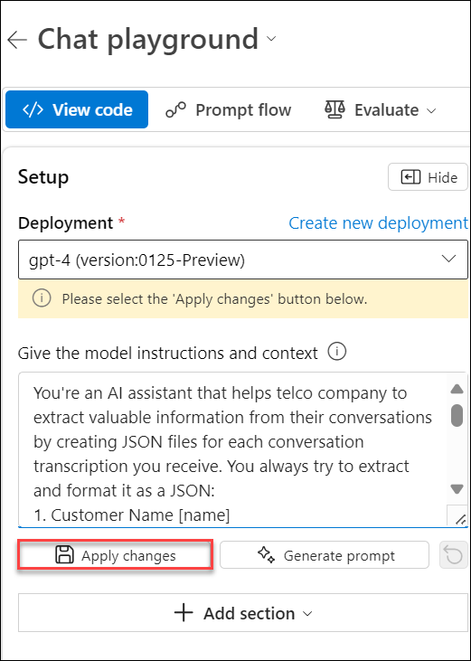

   >**Note:** If you receive an **"Update systems message?"** pop-up, enable **Do not show this again,** and click on **Continue**.

   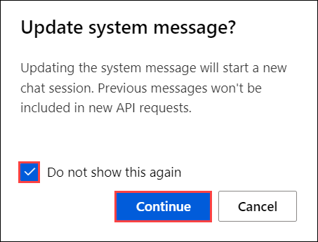
   
1. Copy the following text in the **chat session** and click on the **send** button.

   ```
   Agent: Hello, welcome to Telco's customer service. My name is Juan, how can I assist you?
   Client: Hello, Juan. I'm calling because I'm having issues with my mobile data plan. It's very slow and I can't browse the internet or use my apps.
   Agent: I'm very sorry for the inconvenience, sir. Could you please tell me your phone number and your full name?
   Client: Yes, sure. My number is 011-4567-8910 and my name is Martín Pérez.
   Agent: Thank you, Mr. Pérez. I'm going to check your plan and your data usage. One moment, please.
   Client: Okay, thank you.
   Agent: Mr. Pérez, I've reviewed your plan and I see that you have contracted the basic plan of 2 GB of data per month. Is that correct?
   Client: Yes, that's correct.
   Agent: Well, I inform you that you have consumed 90% of your data limit and you only have 200 MB available until the end of the month. That's why your browsing speed has been reduced.
   Client: What? How is that possible? I barely use the internet on my cell phone. I only check my email and my social networks from time to time. I don't watch videos or download large files.
   Agent: I understand, Mr. Pérez. But keep in mind that some applications consume data in the background, without you realizing it. For example, automatic updates, backups, GPS, etc.
   Client: Well, but they didn't explain that to me when I contracted the plan. They told me that with 2 GB I would have enough for the whole month. I feel cheated.
   Agent: I apologize, Mr. Pérez. It was not our intention to deceive you. I offer you a solution: if you want, you can change your plan to a higher one, with more GB of data and higher speed. This way you can enjoy a better browsing experience.
   Client: And how much would that cost me?
   Agent: We have a special offer for you. For only 10 pesos more per month, you can access the premium plan of 5 GB of data and 4G speed. Are you interested?
   Client: Mmm, I don't know. Isn't there another option? Can't you give me more speed without charging me more?
   Agent: I'm sorry, Mr. Pérez. That's the only option we have available. If you don't change your plan, you'll have to wait until next month to recover your normal speed. Or you can buy an additional data package, but it would be more expensive than changing plans.
   Client: Well, let me think about it. Can I call later to confirm?
   Agent: Of course, Mr. Pérez. You can call whenever you want. The number is the same one you dialled now. Is there anything else I can help you with?
   Client: No, that's all. Thank you for your attention.
   Agent: Thank you, Mr. Pérez. Have a good day. Goodbye.
   ```

   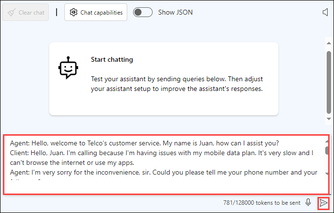

1. You will see a result generated by the model similar to the one shown in the image below. Notice that the model has correctly followed the instructions indicated in the **System message** field.

   ```
   {
   "name": "Martín Pérez",
   "phone": "011-4567-8910",
   "topic": "Mobile data plan issues",
   "sentiment": "Negative",
   "agent_behavior": "Polite and helpful, offered solutions",
   "outcome": "Client is considering options, will call back later",
   "summary": "Client Martín Pérez called to complain about slow mobile data. Agent explained that he had almost reached his data limit for the month, causing the reduced speed. The agent suggested upgrading his plan for better service, but the client was unsure and said he would think about it and call back later."
   }
   ```
   
   
   
## Task 06: Work with an Open Source LLM Model (READ ONLY)

1. Now let's test an **open-source Llama2 model** from Meta. Navigate to **Models + endpoints (1)**. Go back to the **Manage deployments of your models and services** page. Click on **Deploy model (2)** and select **Deploy base model (3)** to create an OpenAI model.
   
   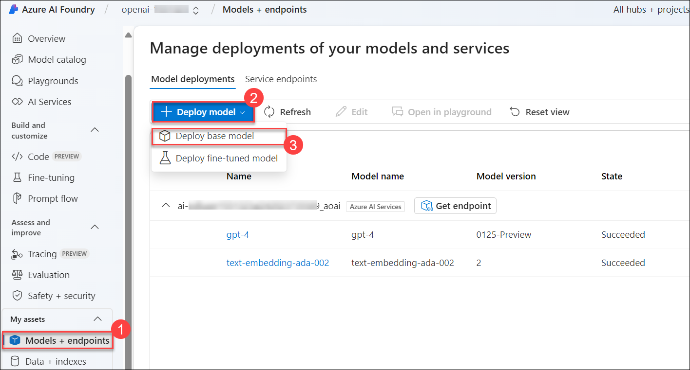

1. Search for and select **Llama-2-13b-chat (1)** from the list of models, and click on **Confirm (2)**.

   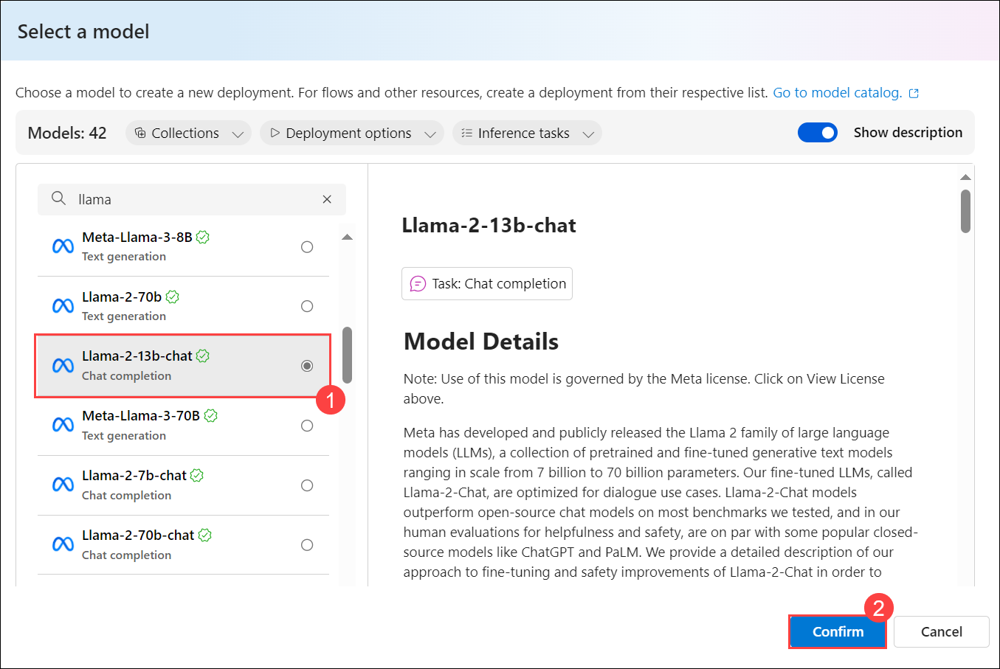

1. On the **Deployment options** tab, click on **Serverless API with Azure AI Content Safety**.

   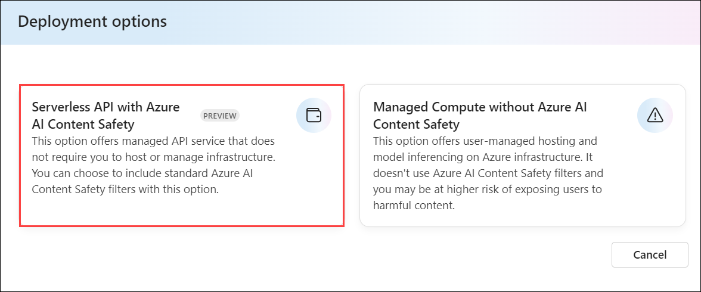

1. On the **Serverless API deployment for Llama-2-13b-chat** tab, select your project and click on **Subscribe and Deploy**.

   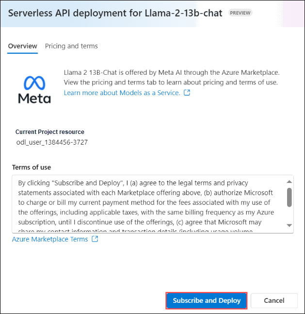

1. Once the **Serverless API deployment for Llama-2-13b-chat** deployment succeeds, click on the **Deploy** option on the **Deploy Llama-2-13b-chat**.

   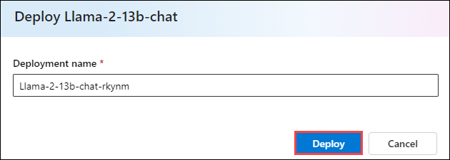

1. Wait for the chat model provisioning state to appear as **Succeeded** before using the deployment.

   .png)

1. On the **Llama-2-13b-chat** deployment details, click on **Open in playground** to start using the **Open Source LLM Model**.

   .png)

## Task 07: Test the prompt in Content Safety

1. On your **Azure AI Foundry,** navigate to **AI Services (1)** and click on the **Content Safety (2)** box to get started with **Content Safety Studio**.

   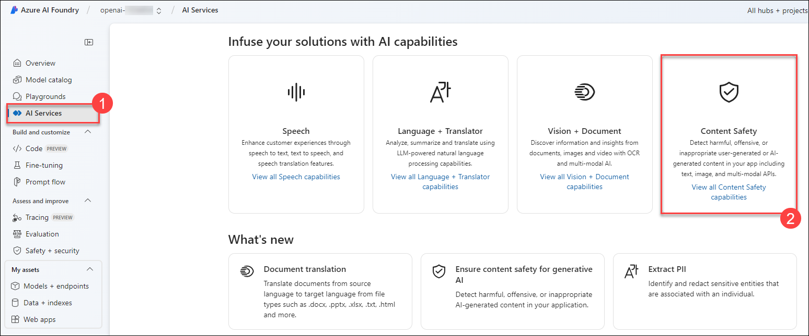

1. On the **Content Safety** studio, click on the **Moderate text content** option to try out the prompt.

   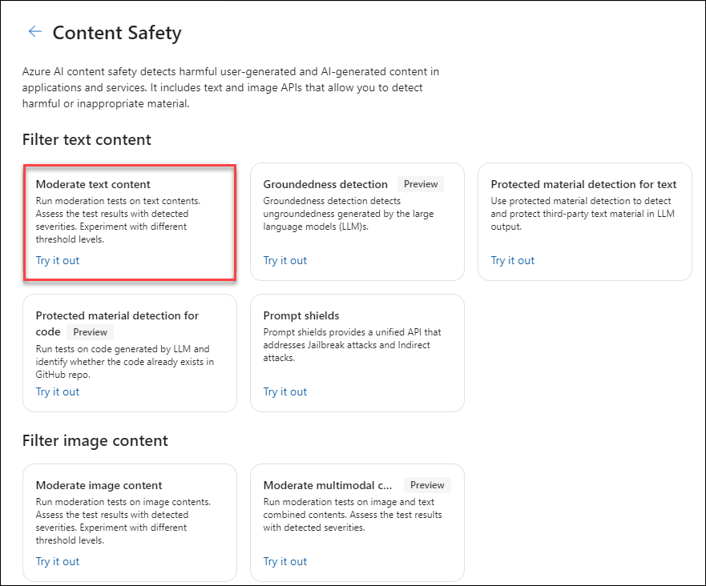

1. On the **Moderate text content** window, select the **content safety resource** from the **Azure AI services resources** dropdown.

   .png)

1. In the **Test** section, copy and paste the below text in the text box and click on **Run test**.

   ```
   You're an AI assistant that helps telco company to extract valuable information from their conversations by creating JSON files for each conversation transcription you receive. 

   You always try to extract and format as a JSON, field names between square brackets:

   1. Customer Name [name]
   2. Customer Contact Phone [phone]
   3. Main Topic of the Conversation [topic]
   4. Customer Sentiment (Neutral, Positive, Negative)[sentiment]
   5. How the Agent Handled the Conversation [agent_behavior]
   6. What was the FINAL Outcome of the Conversation [outcome]
   7. A really brief Summary of the Conversation [summary]

   Conversation:

   Agent: Hi Mr. Perez, welcome to Telco's customer service. My name is Juan, how can I assist you?
   Client: Hello, Juan. I am very dissatisfied with your services.
   Agent: ok sir, I am sorry to hear that, how can I help you?
   Client: I hate this company I will kill everyone with a bomb.
   ```

   .png)

1. In the **View Results** section, notice how the content safety resource blocks the content because the **Violence** filter is triggered with the provided content.

   .png)

1. You can configure the **Threshold level** for the four categories and test out different prompts.

   .png)

## Task 08: Create a Prompt Flow

1. From the left navigation menu, select **Models + endpoints**.

1. Navigate to the **gpt-4** deployment under the **Model deployments** settings in your **Azure AI Foundry** portal.

   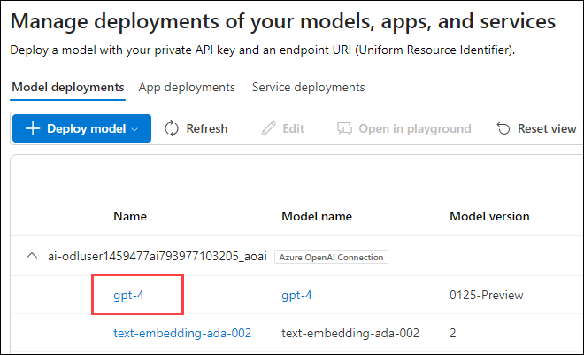

1. On the **gpt-4** deployment details, click on **Open in playground**.

   

1. Verify that the same steps performed in **Task 05** are added as a system message, and ensure you have saved the changes. Once the response is fetched and generated, click on **Prompt Flow**.

   .png)

1. On **"Orchestrate and customize this setup with prompt flow,"** click on **Open**. This will create a new prompt flow.

   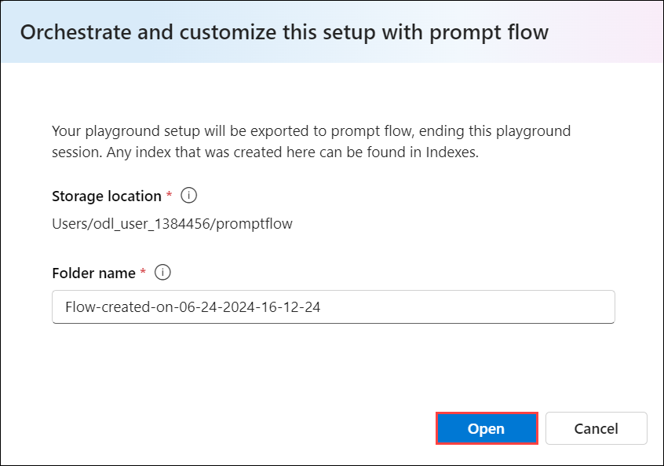

   >**Note:** If it takes too long, refresh the page and re-enter the details and click on **prompt flow**; the prompt flow should appear right away.

1. Notice how the prompt flow is created with a single node, which represents the step in the flow where the LLM model is configured.

   .png)

1. Once the new prompt flow opens, click on **Start compute session** before you start using the chat session.

   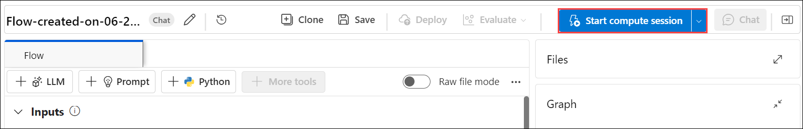

1. Configure the connection settings with the AI service and the GPT-4 deployment for the **chat** node, and then click on the **Chat** button to test your flow in the **chat window**.

   .png)

1. In the **chat window**, copy and paste the below conversation and click on **send** to view the expected response.

   ```
   Agent: Hello, welcome to Telco's customer service. My name is Juan, how can I assist you?
   Client: Hello, Juan. I'm calling because I'm having issues with my mobile data plan. It's very slow and I can't browse the internet or use my apps.
   Agent: I'm very sorry for the inconvenience, sir. Could you please tell me your phone number and your full name?
   Client: Yes, sure. My number is 011-4567-8910 and my name is Martín Pérez.
   Agent: Thank you, Mr. Pérez. I'm going to check your plan and your data usage. One moment, please.
   Client: Okay, thank you.
   Agent: Mr. Pérez, I've reviewed your plan and I see that you have contracted the basic plan of 2 GB of data per month. Is that correct?
   Client: Yes, that's correct.
   Agent: Well, I inform you that you have consumed 90% of your data limit and you only have 200 MB available until the end of the month. That's why your browsing speed has been reduced.
   Client: What? How is that possible? I barely use the internet on my cell phone. I only check my email and my social networks from time to time. I don't watch videos or download large files.
   Agent: I understand, Mr. Pérez. But keep in mind that some applications consume data in the background, without you realizing it. For example, automatic updates, backups, GPS, etc.
   Client: Well, but they didn't explain that to me when I contracted the plan. They told me that with 2 GB I would have enough for the whole month. I feel cheated.
   Agent: I apologize, Mr. Pérez. It was not our intention to deceive you. I offer you a solution: if you want, you can change your plan to a higher one, with more GB of data and higher speed. This way you can enjoy a better browsing experience.
   Client: And how much would that cost me?
   Agent: We have a special offer for you. For only 10 pesos more per month, you can access the premium plan of 5 GB of data and 4G speed. Are you interested?
   Client: Mmm, I don't know. Isn't there another option? Can't you give me more speed without charging me more?
   Agent: I'm sorry, Mr. Pérez. That's the only option we have available. If you don't change your plan, you'll have to wait until next month to recover your normal speed. Or you can buy an additional data package, but it would be more expensive than changing plans.
   Client: Well, let me think about it. Can I call later to confirm?
   Agent: Of course, Mr. Pérez. You can call whenever you want. The number is the same one you dialled now. Is there anything else I can help you with?
   Client: No, that's all. Thank you for your attention.
   Agent: Thank you, Mr. Pérez. Have a good day. Goodbye.
   ```

   .png)

   >**Note:** Please press Enter if the send icon is not visible.

   >**Note:** This result validates the **Prompt Flow** by testing its ability to handle real customer interactions, generate expected outputs, summarize key details, and replicate, ensuring the AI performs effectively for customer service use cases.

## Summary

In this lab, you have performed  the following tasks:

- Created an AI project and AI hub resources.
- Deployed Azure OpenAI models.
- Created a content safety service.
- Added an Azure content safety connection.
- Used Azure AI Foundry playground.
- Worked with an open-source LLM model.
- Tested the prompt in content safety.
- Created a prompt flow.

#### You have successfully completed the lab. Click Next >> to move on to the next set of exercises.