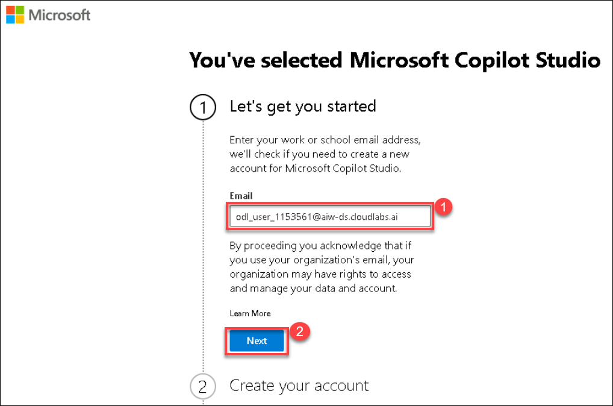
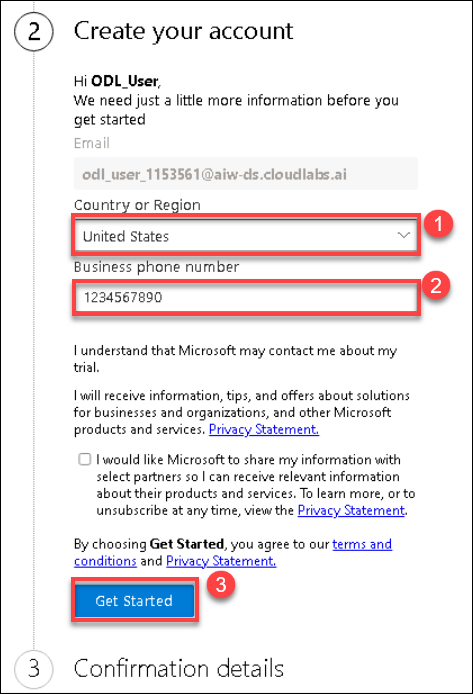
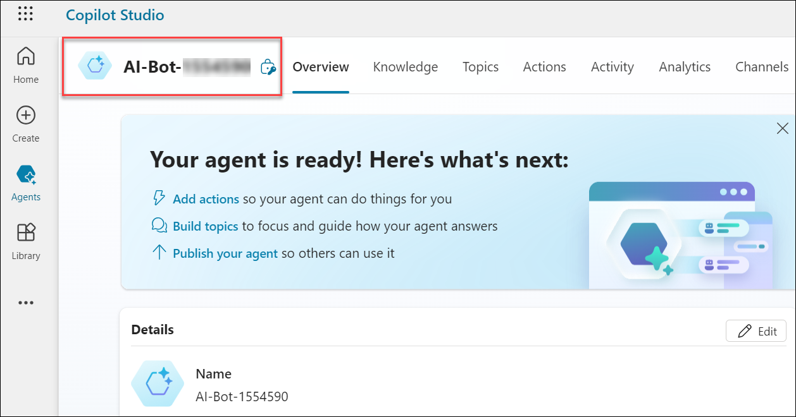
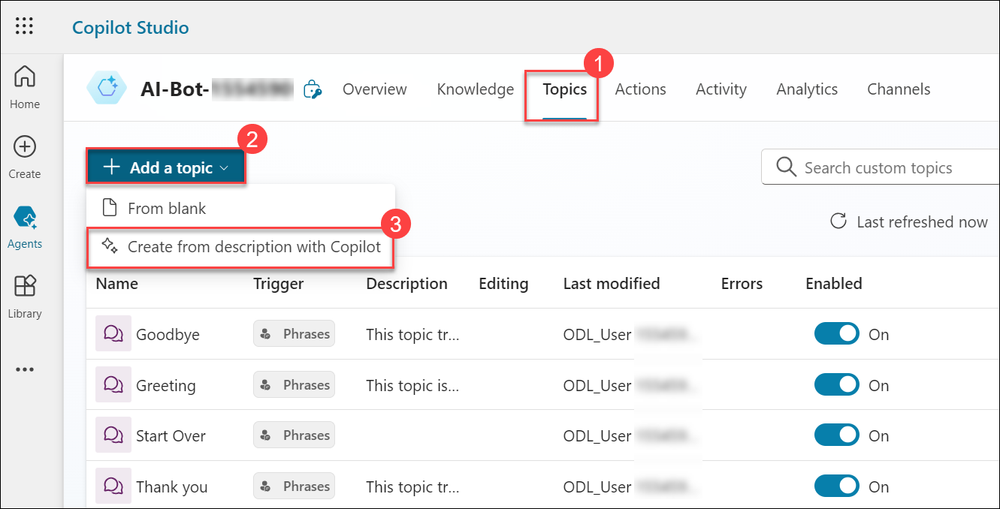
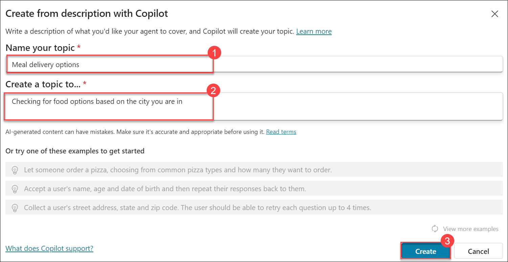
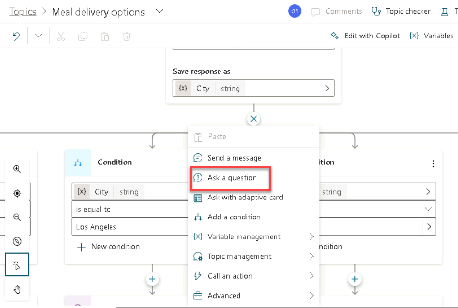
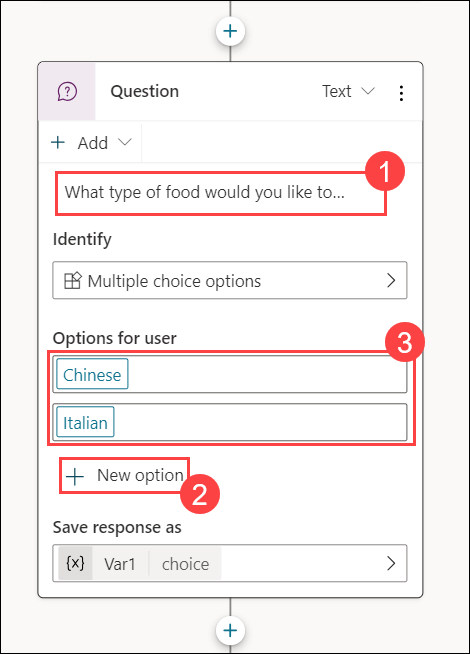
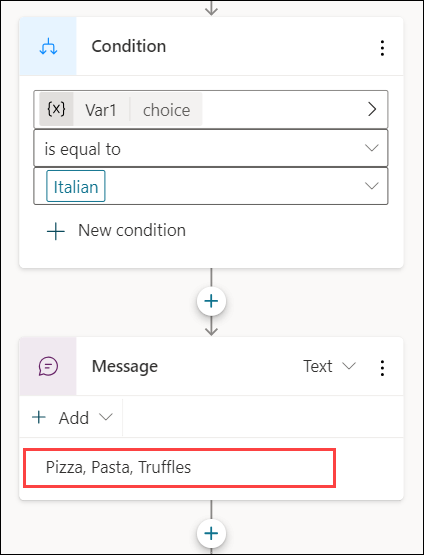
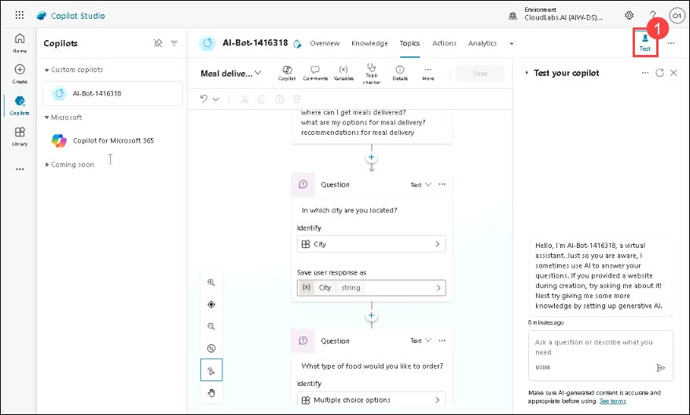
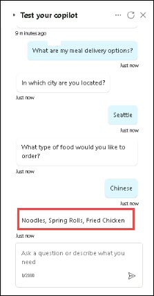

# Lab 5: Conversational AI with Bot Service using Power Virtual Agents

### Estimated Duration: 1 Hour 30 Minutes

Conversational AI with Bot Service using Power Virtual Agents allows users to create and deploy sophisticated chatbots with no code, enabling automated interactions and enhanced customer engagement through intuitive, customizable conversational flows.

## Lab Objectives

- Task 1 - Explore the lab scenario
- Task 2 - Setting up Microsoft Copilot Studio and creating your first Copilot
- Task 3 - Create a New Topic
- Task 4 - Test your Copilot

## Task 1 - Explore the Lab Scenario

The power of Machine Learning also comes into play when dealing with human-to-machine interfaces. While classical interfaces like native or web applications are ubiquitous, new approaches based on conversational AI are becoming increasingly popular. Having the capability to interact with intelligent services using natural language is quickly becoming the norm rather than the exception. Using Conversational AI, analysts can find the research of interest by using simple natural language phrases.

With Machine Learning (ML) and Natural Language Processing (NLP), Human Machine Interface (HMI) technologies are enjoying an increased adoption year over year. By 2021, [the growth of chatbots in this space is expected to be 25.07%](https://www.technavio.com/report/chatbot-market-industry-analysis).


The way organizations are building conversational systems is evolving, with bots being built and maintained by a mix of technical and non-technical roles. Power Virtual Agents has the capability to extend its capabilities by allowing pro-code users to create dialogs/topics using the Azure Bot Framework Composer today. This experience allows technical and non-technical teams to build and host their solutions on a single platform.


## Task 2 - Setting Up Microsoft Copilot Studio and Creating Your First Copilot

1. Open a new tab in the browser. Navigate to the **[Microsoft Copilot Studio page](https://www.microsoft.com/en-us/copilot/microsoft-copilot-studio)** and select **Try Free**. 

   

1. On the **Let's get you started**, enter the **Email: <inject key="AzureAdUserEmail"></inject> (1)** and select **Next (2)**. Then click on **Sign in.** 

   
   

1. Once **signed in**, under Create your account, **choose your respective region (1)** from the drop down menu, enter your **phone number (2)**, and click on **Get Started (3)**.
   
   
   
1. Under the **Confirmation details (1)**, click on **Get Started (2)**.

    

1. You have now successfully signed up for **Microsoft Copilot Studio**.

1. On the **Welcome to Microsoft Copilot Studio** page, choose your **respective region (1)** and select **Get Started (2)**.

    

    >**Note:** If any pop-up appears, then select **Skip**.

1. On the **Create a Copilot** page, enter the following details:

   - **Copilot name (1)**: Enter **AI-Bot-<inject key="DeploymentID" enableCopy="false"/>**.

   - Now select **Create (2)**.

      

      >**Note:** If the name section does not appear, select **Skip to Configure**.
      
1. Once the Bot is created, you will see the Copilot Studio page.

    

## Task 3 - Create a New Topic

1. On the **Microsoft Copilot Studio** page, select **Topics** **(1)**, **+ Add a topic** **(2)**, and from the drop down menu, select **Create from description with Copilot** **(3)**.

   

2. In **Create it with Copilot** pane, name your topic **Meal delivery options** **(1)**. In Create a topic to ..., enter the particular phrase "**Checking for food options based on the city you are in**" **(2)**, then click on **Create** **(3)**.

   

   >**Note:** If you receive any pop up which states **See text and images copied to the clipboard**, select **Allow**.

3. Once you are in the topic pane, **close** the edit with the Copilot pane from the right side.

4. On the **topics** pane, click on **+** at the bottom of the **Question** node to **Add node**.

   

5. Select **Ask a question** from the drop down while adding a node.

   

6. Enter the question "**What type of food would you like to order?**" **(1),** and under options for users, click on **New option** **(2)** to add types of food. Add **Chinese** and **Italian** **(3),** as shown in the below screenshot.

    
   
7. Now, under Chinese conditions, click on **+** to add a node.

   

8. Select **Send a message** from the drop down while adding a node.

   

9. Enter the Chinese food items given here in the message section: **Noodles, Spring Rolls, and Fried Chicken.**

   

10. Now under Italian condition, click on **+** to Add a node.

    

11. Select **Send a message** from the drop down menu when adding a node.

    

12. Enter the Italian food items given here in the message section: **Pizza, Pasta, Truffles.**

    

13. Review the topic trigger and click on **Save** from the top right corner to save the topic.

    


> **Congratulations** on completing the task! Now, it's time to validate it. Here are the steps:
> - Click on the **Validate** button for the corresponding task. If you receive a success message, you can proceed to the next task. 
> - If not, carefully read the error message and retry the step, following the instructions in the lab guide.
> - If you need any assistance, please contact us at **labs-support@spektrasystems.com**. We are available 24/7 to help you out.

<validation step="298a93c6-d52c-4f6d-97c7-2d27136af729" />


## Task 4 - Test your Copilot

1. Once the topic is saved, click on **Test Copilot (1)** from the top right corner.

   

1. In the Test Copilot pane, enter the given phrase ```"What are my meal delivery options?"``` and then enter the city name as ```Seattle```. You can select the type of food that you are looking for, i.e., Chinese or Italian. 

   
 
1. Your chatbot should display the names of the meals as shown below.

   

1. Close the tab.

Now, you have successfully created and tested the Microsoft Copilot.

## Summary 

In this lab, you set up Microsoft Copilot Studio, created your first Copilot, and tested it by developing and validating a new topic.

### You have successfully completed the lab. Click Next >> to move on to the next set of exercises.
