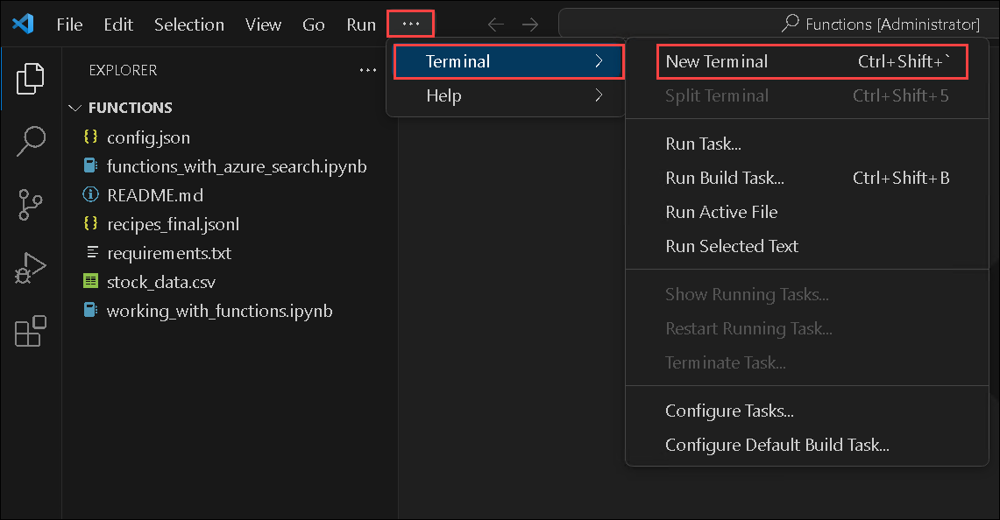

# Lab 7: Understand function calling in OpenAI GPT

## Lab Scenario

Over the last couple of years, language models like GPT-3 and GPT-4 have demonstrated their immense power and versatility. These models have been successfully applied in various scenarios, showcasing their capabilities. While these models are already valuable on their own, the Azure OpenAI Service now offers an exciting new feature called function calling. With function calling, the latest versions of GPT-3 and GPT-4 can generate structured JSON outputs based on functions specified in the request. This allows developers to integrate the models with other systems and tools, enabling even more possibilities. However, it's important to note that while the models can generate the function calls, the execution of these calls remains under your control, ensuring that you maintain full control over the process. In this overview, we will explore how function calling works, provide examples of its use cases, and guide you through the steps to leverage this powerful feature in Azure OpenAI Service. 

## Lab Objectives

You will be able to complete the following tasks:

- Task 1: Understand Function calling

### Estimated Duration: 40 minutes
  
### Task 1: Understand Function calling

In this task, you will configure and test a project in Visual Studio Code by updating necessary settings, installing dependencies, and executing a Jupyter notebook. This ensures that the project is correctly set up and functioning as expected with the integrated APIs and modules.

**Function calling**: Function calling allows you to connect models like gpt-4o to external tools and systems. This is useful for many things such as empowering AI assistants with capabilities, or building deep integrations between your applications and the models.

 Refer to the link for more information.
 
 - [Function Calling](https://platform.openai.com/docs/guides/function-calling)
 - [Function Calling with Azure OpenAI Service](https://learn.microsoft.com/en-us/azure/ai-services/openai/how-to/function-calling)
 - [Function calling is now available in Azure OpenAI Service](https://techcommunity.microsoft.com/t5/azure-ai-services-blog/function-calling-is-now-available-in-azure-openai-service/ba-p/3879241)

1. Open **Visual Studio Code** from the desktop; next, click on **File** and select **Open Folder**.

     

1. Navigate to the below-mentioned path and click on **Select folder**. 

    ```
    C:\LabFiles\openai\Basic_Samples\Functions
    ```

    

1. On the **Do you trust the authors of the files in this folder?** pop-up check the box next to **Trust the authors of all files in the parent folder 'Basic_Samples'**, and select **Yes, I trust the authors**.

     

1. In the **Functions** folder, open `config.json` and replace the following values with the ones you copied earlier. Next, press **CTRL + S** to save the file.

   | **Variables**                | **Values**                                                    |
   | ---------------------------- |---------------------------------------------------------------|
   | **DEPLOYMENT_NAME**          |  **copilot-gpt**              |
   | **OPENAI_API_BASE**          | Paste the OpenAI endpoint          |
   | **OPENAI_API_KEY**           | Paste the OpenAI key               |
   | **SEARCH_SERVICE_ENDPOINT**  | Paste the Azure AI search service URL |
   | **SEARCH_ADMIN_KEY**         | Paste the Azure AI search key |
   
    

   >**Note:** Please cross-verify the endpoints and key values, ensuring there are no repetitions or redundancies.

1. Next, click on the **Eclipse Button (1)** at the top of the screen, then select **Terminal (2)** from the dropdown menu, and click on **New Terminal (3)** to open a new terminal window.

     

1. In the new terminal, run the following command to install the required modules:

    ```
    pip install -r requirements.txt
    ```

1. Once the required modules are installed, close the terminal.

1. Open the `working_with_functions.ipynb` file from the left menu.

     

1. Click on the **Run (1)** button in the first cell. Once the pop-up `Install/Enable suggested extensions Python + Jupyter` appears, click on it to install the Python and Jupyter extensions. 

     

1. Next, on the **Choose a Kernel source** pop-up, select **Python Environments**. This will initiate the installation of the extension.

     

1. Next, on the **Select a Python Environment** pop-up, select **Python 3.12.8**. This will set the Python Environment.  

    > **Note**: If prompt **Runnning cells with 'c:\python3.12.8\python.exe' requires the ipykernel package.** then click on **Install**.

      

1. In the first cell, update the commands as shown below:

    ```
    # if needed, install and/or upgrade to the latest version of the OpenAI Python library
    %pip install openai==0.28
    %pip install pytz
    %pip install pandas
    ```

1. Execute the notebook cell by cell (using either `Ctrl + Enter` to stay on the same cell or `Shift + Enter` to advance to the next cell) and observe the results of each cell execution.

    

    > **Note:** Please ensure to run the notebook end to end and observe the output for each cell. 

1. Now Close the section, and proceed to the next exercise.

    >**Note:** Select **Save**, on the pop-up.

## Summary

In this lab, you have understood Function calling and learned how to set up a Visual Studio Code environment, configure the necessary files for your project, install required modules, and execute a Jupyter notebook. You’ve also gained experience with handling Python environments, using terminal commands, and verifying code execution in Jupyter notebooks.

#### You have successfully completed the lab. Click Next >> to move on to the next set of exercises.