# Lab 8: Deploy and Run the HR/Payroll Copilot Application

### Estimated Duration: 120 Minutes

**Smart Agent: At the heart of the solution is the Python object Smart_Agent. The agent has the following components:**

  - **Goals/Tasks:** Smart_Agent is given a persona and instructions to follow to achieve certain goals; for example, HR Copilot is about helping answer HR/Payroll questions and updating employees' personal information. This is done using instructions specified in the system message.

  - **NLP interaction and tool execution:** For the ability to use multiple tools and functions to accomplish business tasks, the function calling capability of the 0613 version is utilized to intelligently select the right function (validate identity, search the knowledge base, update address, create ticket) based on the agent's judgment of what needs to be done. The agent is also able to engage with users by following the instructions and goals defined in the system message.

  - **Memory:** The agent maintains a memory of the conversation history. The memory is backed by Streamlit's session state.
  - **LLM:** The agent is linked to a 0613 GPT-4 model to power its intelligence.

## Lab Objectives

You will be able to complete the following tasks:

- Task 1: Build your own HR/Payroll copilot locally
- Task 2: Integrate Azure Cognitive Search with your application
- Task 3: Deploy the HR/Payroll Copilot application to Azure
    
### Task 1: Build Your Own HR/Payroll Copilot Locally

**HR/Payroll Copilot**: The HR/Payroll Copilot is a locally hosted application designed to assist with HR and payroll-related tasks. It integrates with Azure OpenAI and Cognitive Search to perform functions such as:

- **Employee Identity Verification**: Confirming employee identity based on provided credentials.
- **Information Queries**: Answering questions related to HR policies, payroll schedules, or other employee concerns.
- **Information Updates**: Allowing employees to submit requests for updates to their personal information, such as address changes, and logging these requests for HR review.

By running this application locally, you can test and interact with its features to ensure it functions as intended before deployment in a production environment.


1. In the LabVM, open File Explorer, navigate to the below-mentioned path, right-click on the `secrets.env` file, and select open with  **Visual Studio Code**.

   ```
   C:\Labfiles\OpenAIWorkshop\scenarios\incubations\copilot
   ```

    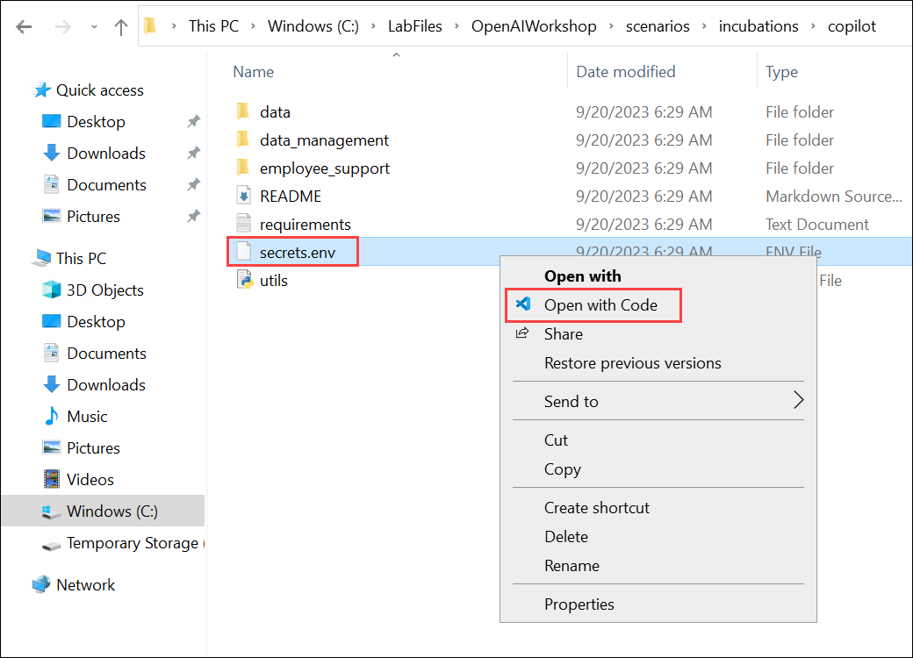

    >**Note:** If you recieve **Do you want to allow untrusted files in this workspace?** pop-up, select **Open**.

2. The Visual Studio code is opened on the desktop. Edit the below code and update the **Azure OpenAI Key**, **Embedding Model name, GPT Deployment name**, **Azure OpenAI Endpoint**, **Cognitive Search Endpoint**, and **AZURE_SEARCH_ADMIN_KEY** values that you have copied and stored in the text file earlier.

   | **Variables**                | **Values**                                                    |
   | ---------------------------- |---------------------------------------------------------------|
   | **AZURE_OPENAI_CHAT_DEPLOYMENT**          |  Replace the value with your **YOUR_GPT_MODEL** name that is **copilot-gpt**         |      
   | **AZURE_OPENAI_EMB_DEPLOYMENT**          |  Replace the value with your **YOUR_EMBEDDING_MODEL** name that is **CompletionModel**    |
   | **AZURE_OPENAI_API_ENDPOINT**          | Replace the value with OpenAI endpoint value          |
   | **AZURE_OPENAI_API_KEY**           | Replace the value with OpenAI key               |
   | **AZURE_SEARCH_SERVICE_ENDPOINT**  | Replace the value with Azure search service URL        |
   | **AZURE_SEARCH_ADMIN_KEY**         | Replace the value with Azure search service key           |

3. After updating values, the `secrets.env` file should be as shown in the below screenshot. Press **CTRL + S** to save the file.

    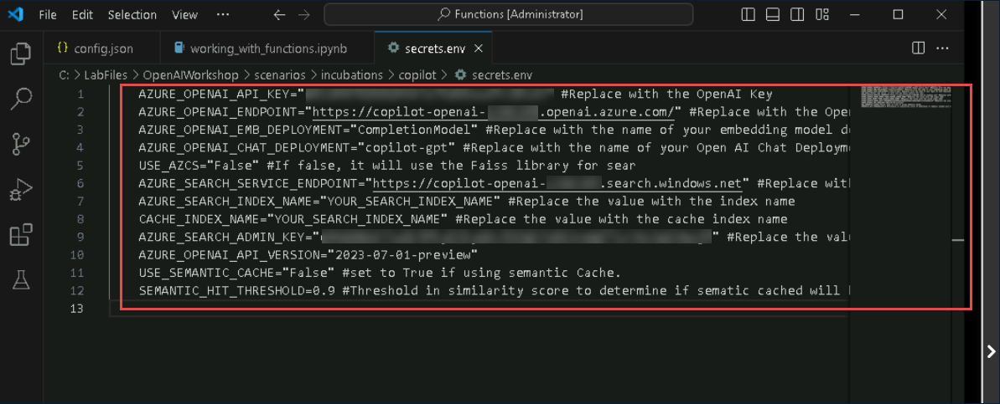

4. To run the application from the command line, press **CTRL + J** to open the terminal:

   > **Note**: Here, you can enter your email address below to get notifications. Otherwise, leave this field blank and click on **Enter**.

   ```
   cd C:\Labfiles\OpenAIWorkshop\scenarios\incubations\copilot\employee_support
   streamlit run hr_copilot.py
   ```

   >**Note:** If you encounter any errors, press **Ctrl+C** to stop the command. Then, run the following commands in the terminal. After running these commands, re-run **step 04**.

      ```
      python -m venv myenv
      myenv\Scripts\activate
      pip install -r requirements.txt 
      ```

5. Once the execution of `streamlit run hr_copilot.py` is completed, a locally hosted HR Copilot application will be opened in the web browser. 

   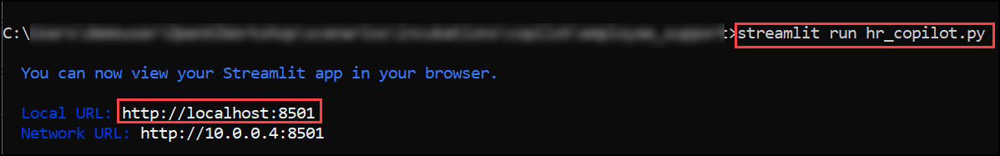

   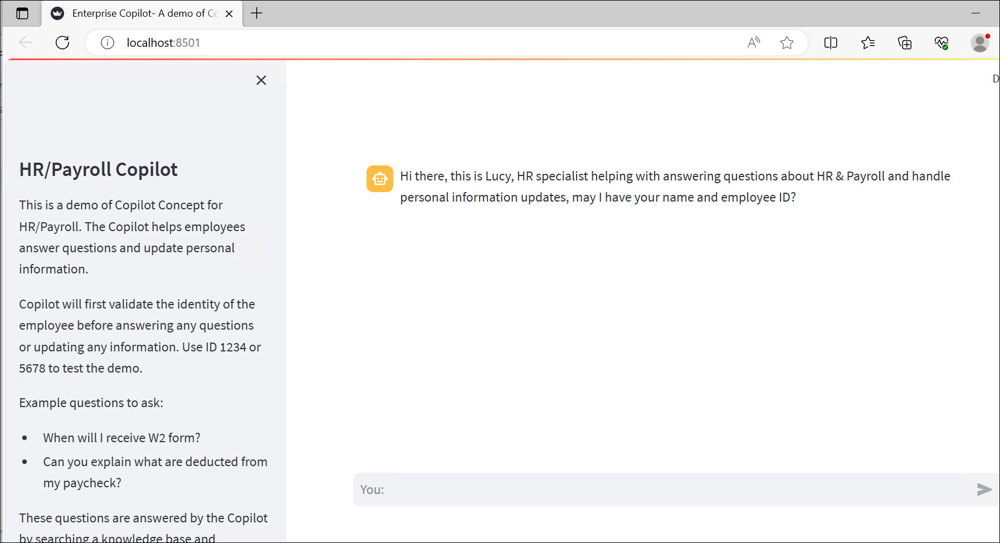

6. Run the following query to validate the identity of the employee:

   ```
   John 1234
   ```

   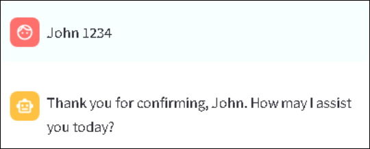

   >**Note**: The output you receive might differ on your system, but it must follow this format for the subsequent steps to proceed.

7. Enter an example question such as `When will I receive the W2 form?`. The questions are answered by the Copilot by searching a knowledge base.

   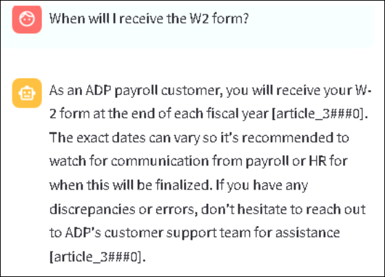

   >**Note**: The output you receive might differ on your system, but it must follow this format for the subsequent steps to proceed.

8. Copilot can help update employee information, such as address updates. For other information update requests, Copilot will log a ticket to the HR team to update the information. Enter `I moved to 123 Main St., San Jose, CA 95112, please update my address` in the HR Copilot app.

    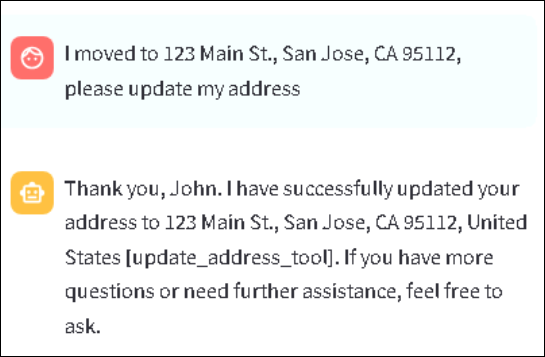

    >**Note**: The output you receive might differ on your system, but it must follow this format for the subsequent steps to proceed.

9. Navigate back to the **terminal** in VS Code and stop the terminal by pressing **Ctrl + C** on the keyboard.

### Task 2: Integrate Azure Cognitive Search with your Application

In this task, you will configure Azure Storage and AI Search services, update credentials in the `secrets.env` file, and run the HR Copilot application locally using Streamlit. You will test the application by querying employee data and verifying its integration with Azure services. Troubleshooting steps will include installing the required packages to ensure smooth functionality.

1. Navigate back to the **Azure Portal.** Start by searching for **Storage accounts** in the search bar at the top of the page. Click on the **Storage accounts** option from the search results.

    

1. From the **Storage accounts** page, locate and select the storage account named **aiinadaystorage<inject key="DeploymentID" enableCopy="false"/>**. This action will open the details and management options for the selected storage account.

    

1. From the left-hand menu of the **aiinadaystorage<inject key="DeploymentID" enableCopy="false"/>** page, choose **Access keys (1)** under the **Security + networking** section. This section will display the connection strings associated with your storage account. Copy the **Connection string (2)** provided and save it in a text file for future reference and use.

    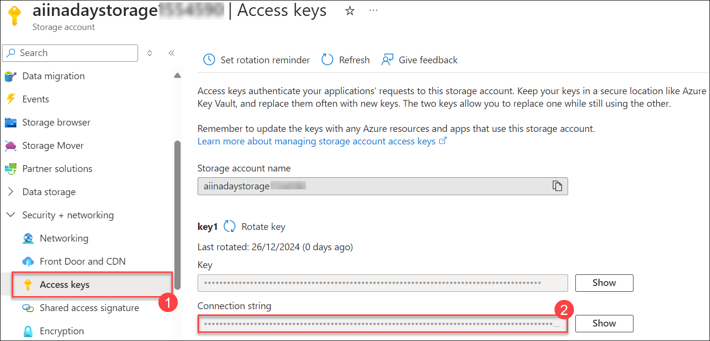

1. Next, open **Azure OpenAI**, and choose **AI search (1)** from the left-hand menu. Then, click on the service named **aiinaday-cog-<inject key="Deployment ID" enableCopy="false"/> (2)** to access its configuration and management options.

   

1. On the **Overview** page, locate and click on the **Import data** button. This action will initiate the process of importing data into your Azure AI service.

    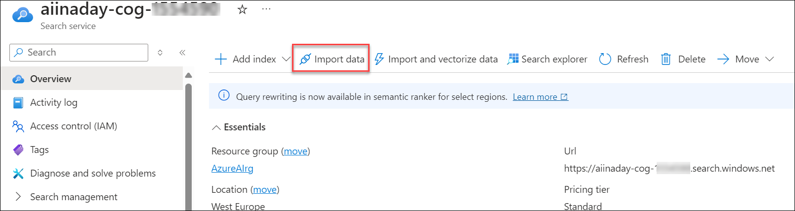

1. Choose **Azure Blob storage** as the **Data source**. This option allows you to import data from your Azure Blob storage into the AI service.

    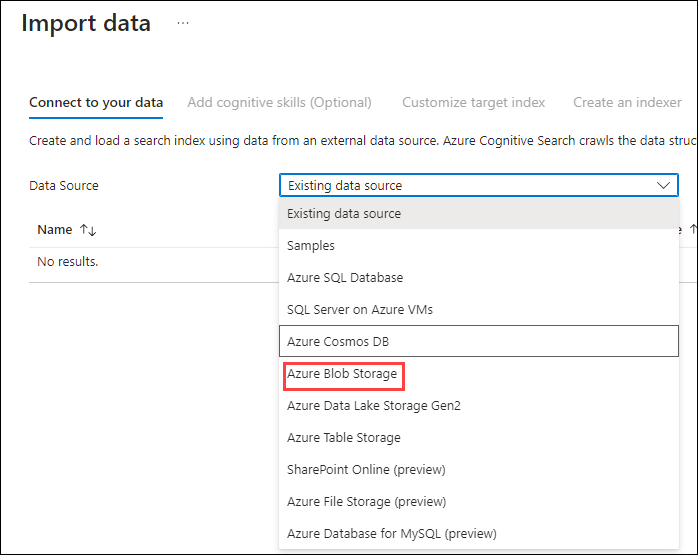

1. On the **Connect to your data** tab, provide the following details and click on **Next: Add cognitive skills (optional) (7)**.

   | Settings| value|
   |---|---|
   |Data source name| **copilotstorage<inject key="Deployment ID" enableCopy="false"/>** **(1)**|
   |Data to extract| **Content and metadata** **(2)**|
   |Parsing mode| **JSON array** **(3)**|
   |Connection string | **YOUR_STORAGE_ACCOUNT_CONNECTIONSTRING (4)**|
   |Container name| **data (5)**|
   |Blob folder| **data (6)**|

   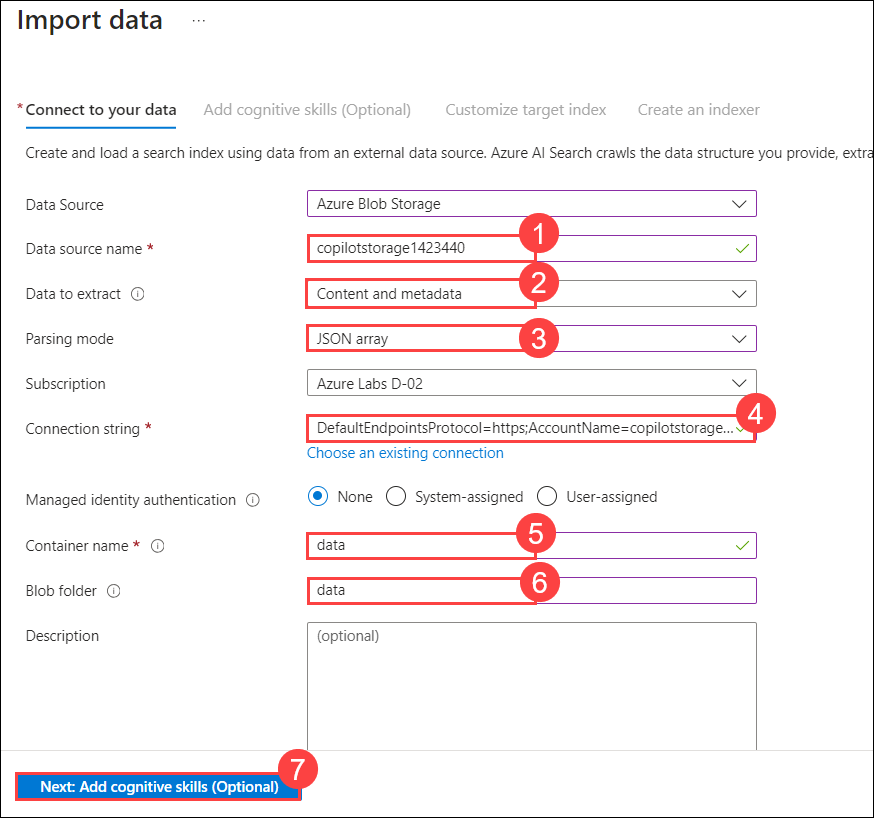

1. On the **Add cognitive skills (optional)** tab, accept the default settings and click on **Skip to: Customize target index** to move forward.

1. On the **Customize target index** tab, enter **payroll-hr (1)** as the **Index name**. 

   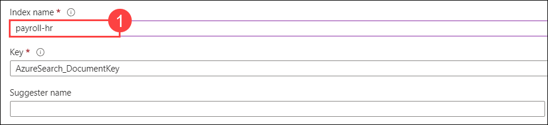

1. Configure the fields as shown in the image:

   - Select **+ Add field**. Give the name as **contentVector**.
   - **contentVector**: Set the type to `Collection(Edm.Single)`.

   - Select **+ Add field**. Give the name as **id**.
   - **id**: Check the boxes for **Filterable**, **Sortable,** and **Facetable**.

   - **content**: Check the **Searchable** box.

   - Ensure **Retrievable** is selected for all fields.

     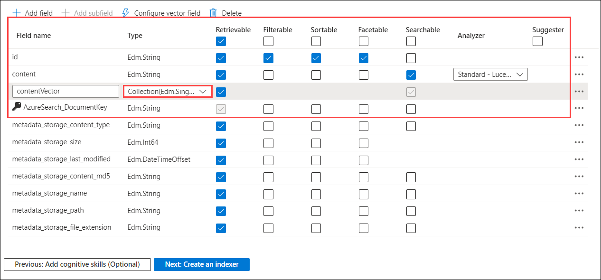

     >**Note:** While adding the id field, if the sortable checkbox is missing, skip it for now and proceed with the next steps.

1. Next, on the **contentVector** field, click on the **Eclipse** button in the right corner and select **Configure vector field**.

      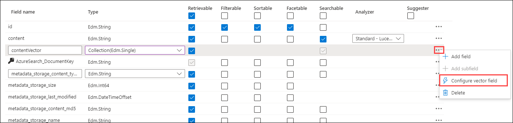

1. On the **Configure vector field** tab, set the **Dimensions** property to `1536` **(1)** and click on **Create** under **No Vector search profiles**.

      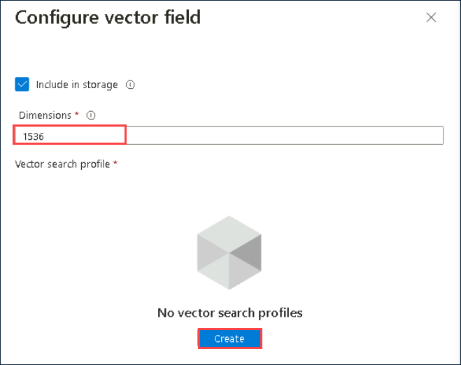

1. On the **Vector profile** tab, click on **Create** under No algorithm configurations.

      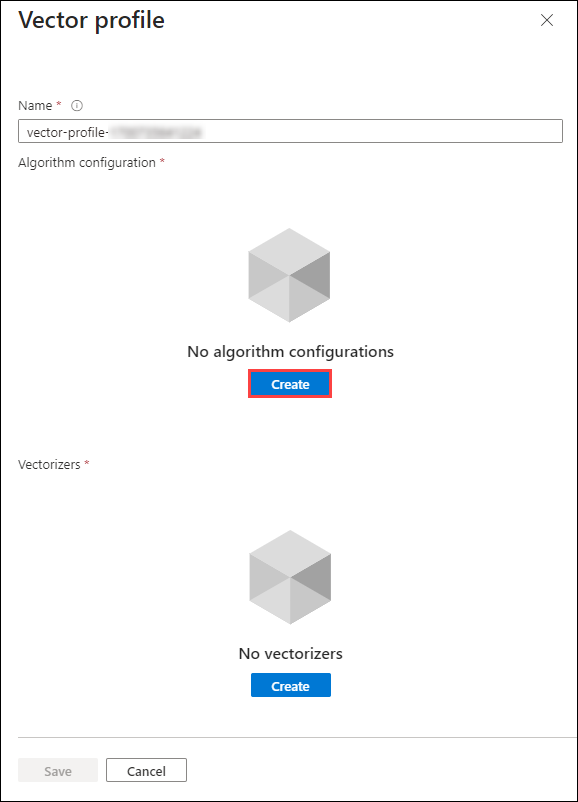

1. On the **Vector algorithm** tab, leave the default and click on **Save**.

      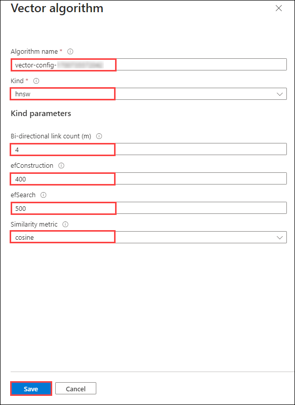

1. On the **Vector profile** tab, select the algorithm created in the previous step and click on **Create** under **No Vectorizers**.

      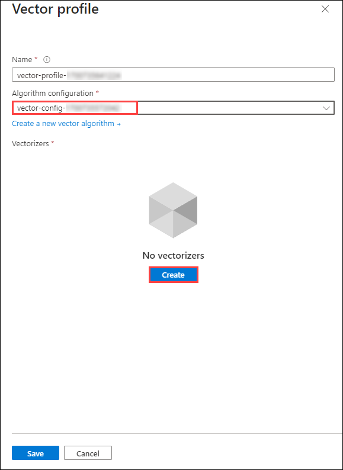

1. On the **Vector algorithm** tab, leave the default and select the Azure OpenAI service as **OpenAI-Lab01-<inject key="Deployment ID" enableCopy="false"/>** and model deployment as **CompletionModel.** Click on **Save**.

      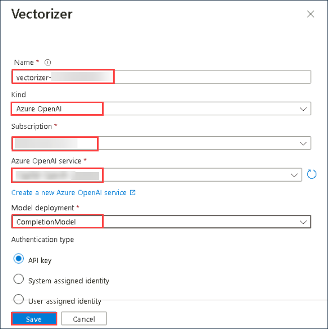

1. On the **Vector profile** tab, select the Vectorizers created in the previous step and click on **Save**.

      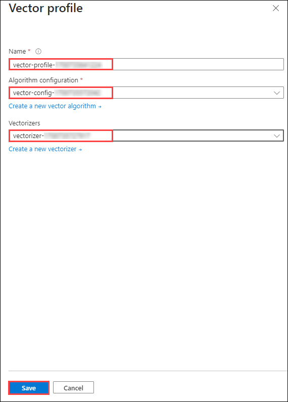

1. On the **Configure vector field** tab, keep the **Dimensions** property to `1536` and **Vector profile** created in the previous step and click on **Save**. Click on **Next: Create an indexer**.

    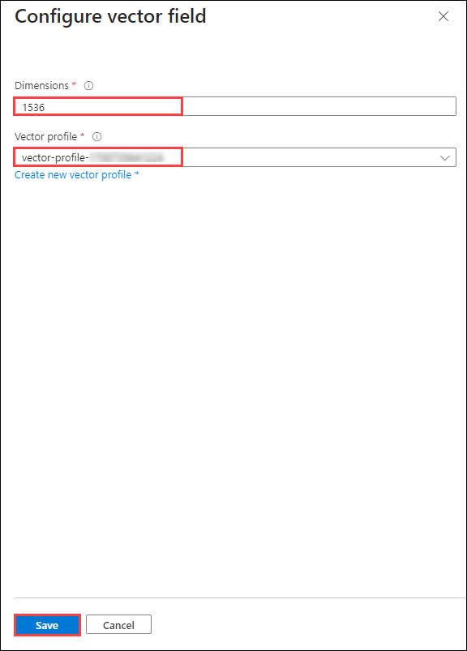
    
    > **Note**: If you are unable to save the **Configure Vector Field**, try deleting the **ContentVector** field. Then, recreate the field with the name **ContentVector** and select **Collection.single** for the **ContentVector** field and reperform from step 10 to step 17.

1. Enter the **Indexer name** as **payroll-hr**, and click on **Submit**.

      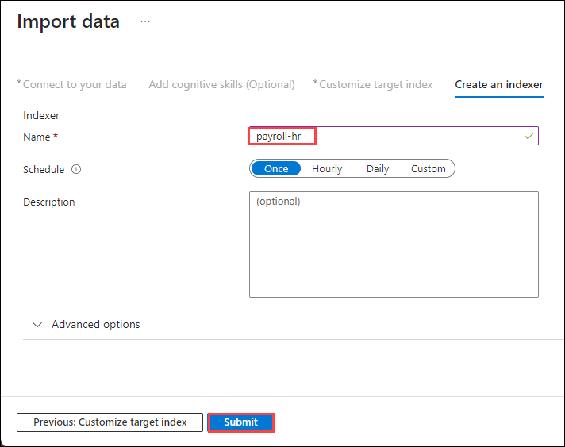

1. From the **Overview (1)** page, click on **Import data (2)** again.

       

1. On the **Connect to your data** tab, select the existing data source and select the storage account, then click **Next: Add cognitive skills (optional)**.

      

1. On the **Add cognitive skills (optional)** tab, leave the default and click on **Skip to: Customize target index**.

1. Next, on the **Customize target index**  tab, enter the **Index name** as **payroll-hr-cache (1)**. 

      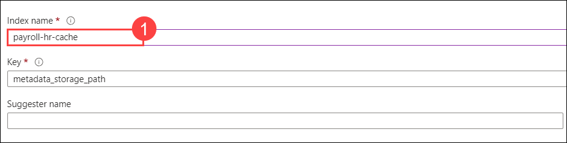

1. Click on **+ Add field** and create the fields **id**, **search_query**, **search_query_vector**, and **gpt_response** with the following configurations:

   - **id**: Check the boxes for **Filterable**, **Sortable**, and **Facetable**.

   - **search_query** and **gpt_response**: Check the **Searchable** box.

   - **search_query_vector**: Select **Collection (Edm.Single)** as the type.

   - Ensure **Retrievable** is selected for all fields.

      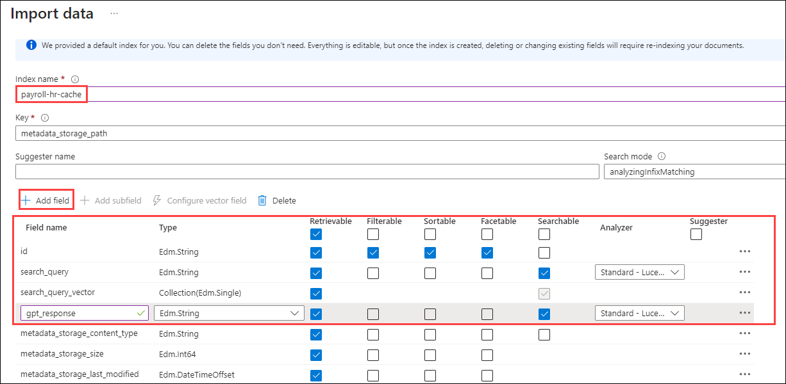

1. In the **search_query_vector** field, click on the **Eclipse** button in the right corner and select **Configure vector field**.

      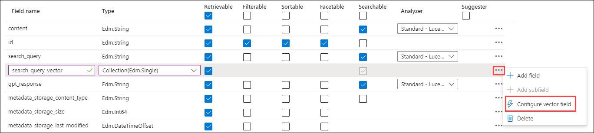

1. On the **Configure vector field** tab, set the **Dimensions** property to `1536` **(1)** and click on **Create** **(2)** under No Vector search profiles.

      

1. On the **Vector profile** tab, click on **Create** under No algorithm configurations.

      

1. On the **Vector algorithm** tab, leave the default and click on **Save**.

      

1. On the **Vector profile** tab, select the algorithm created in the previous step and click on **Create** under No vectorizers.

      

1. On the **Vector algorithm** tab, leave the default and select the Azure OpenAI service as **OpenAI-Lab01-<inject key="Deployment ID" enableCopy="false"/>** and model deployment as **CompletionModel.** Click on **Save**.

      

1. On the **Vector profile** tab, select the Vectorizers created in the previous step and click on **Save**.

      

1. On the **Configure vector field** tab, keep the **Dimensions** property to `1536` and **Vector profile** created in the previous step and click on **Save**. Click on **Next: Create an indexer**.

      

1. Enter the **Indexer name** as **payroll-hr-cache**, and click on **Submit**.

      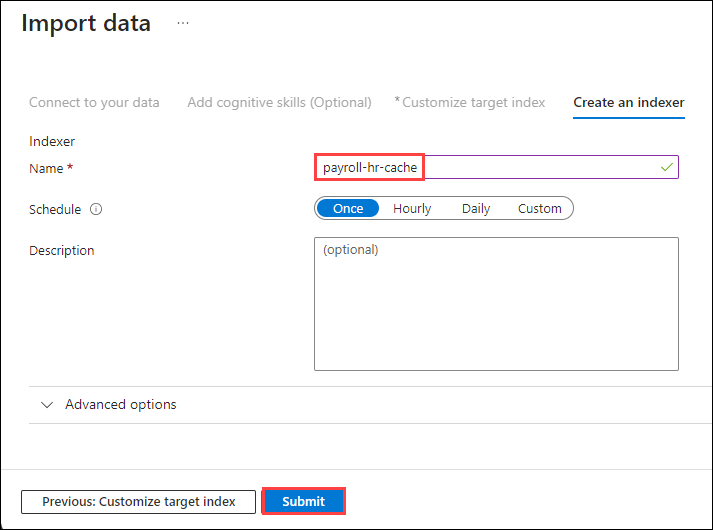

      >**Note:** If you were unable to select the **Sortable** checkbox in the **id** field while creating **payroll-hr**, follow these steps:
      
      >- In **aiinaday-cog-<inject key="DeploymentID" enableCopy="false"/>**, go to **Search management** from the left navigation pane, select the **Indexes** tab and delete **payroll-hr**.

      >- From the left navigation pane, select **Indexers** and delete **payroll-hr**.

      >- Repeat steps **5-18**. On the **Connect to your data** tab, select the existing data source, choose the storage account, and click **Next: Add cognitive skills (optional)**.

      

1. Navigate to the **Indexes** tab under the **Search management** section to view the newly created indexes, copy the index names, and save them in a text editor for later use.

1. Click on **Keys** from the left menu, copy the **Primary admin keys**, and store them in a text file for later use.

1. Return to the `secrets.env` file that you previously opened in Visual Studio Code. This file contains environment variables essential for configuring your application. Make sure it is open and ready for editing.


1. The Visual Studio code is opened on the desktop. Replace the following values and press **CTRL + S** to save the file.

    | Setting | Action |
    | -- | -- |
    | USE_AZCS | **True** |
    | AZURE_SEARCH_INDEX_NAME | **payroll-hr** |
    | CACHE_INDEX_NAME | **payroll-hr-cache** |

1. Next, press **CTRL + J** to open the existing terminal.

1. Run the command below to change the directory and run the HR Copilot application using the search service.

      > **Note**: Here, you can enter your email address below to get notifications. Otherwise, leave this field blank and click on **Enter**.

    ```bash
    cd C:\Labfiles\OpenAIWorkshop\scenarios\incubations\copilot\employee_support
    streamlit run hr_copilot.py
    ```

1. Run the following query to validate the identity of the employee:
   
      ```
      john 1234
      ```

    

    >**Note**: The output you receive might differ on your system, but it must follow this format for the subsequent steps to proceed.


1. Enter an example question such as `When will I receive the W2 form?`. The questions are now answered by the Copilot by searching a knowledge base. You can review this by navigating back to the command prompt and viewing the output.

      

      

    > **Note**: If you faced any issues while providing the above input, please try to run the command **pip install azure-search-documents==11.4.0b9** in the vs code at the file location and again try to perform from the step 37.

    >**Note**: The output you receive might differ on your system, but it must follow this format for the subsequent steps to proceed. 

1. Navigate back to **Terminal** in vs code and stop the terminal by typing **ctrl + C**.

### Task 3: Deploy the HR/Payroll Copilot Application to Azure

1. In the LabVM, open File Explorer, navigate to the below-mentioned path, right-click on the `main.bicep` file, and select open with  **Visual Studio Code**.

      ```
      C:\LabFiles\OpenAIWorkshop\infra
      ```

    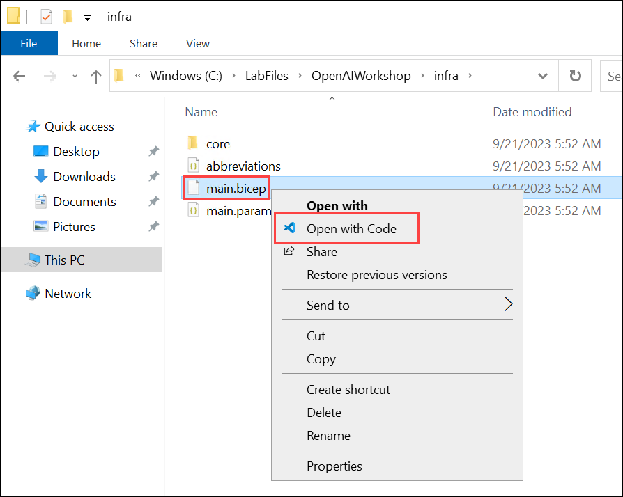

2. In the **appsettings** section of the `main.bicep` file, replace the values below with the ones you copied previously in the text editor. Next, press **CTRL + S** to save the file.

   | **Variables**                     | **Values**                                                    |
   | --------------------------------- |---------------------------------------------------------------|
   | **AZURE_OPENAI_API_KEY** | Replace with OpenAI key value |
   | **AZURE_OPENAI_ENDPOINT** | Replace with OpenAI endpoint value  |
   | **AZURE_OPENAI_EMB_DEPLOYMENT** |  Replace the value with your **YOUR_EMBEDDING_MODEL** name that is **CompletionModel** |
   | **AZURE_OPENAI_CHAT_DEPLOYMENT**  |  Replace the value with your **YOUR_GPT_MODEL** name that is **copilot-gpt** |
   | **AZURE_SEARCH_SERVICE_ENDPOINT** | Replace with Azure Search Service URL |
   | **AZURE_SEARCH_ADMIN_KEY** | Replace with Azure Search Service key |

   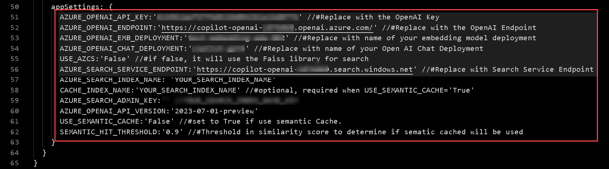

4. In the LabVM, navigate to Desktop and search for `cmd` in the search box, then click on **Command Prompt**.

5. Run the below command to change the directory.
   
   ```bash
   cd C:\LabFiles\OpenAIWorkshop
   ```

6. Run the below command to **Authenticate with Azure**. It will redirect you to the Azure-authorized website. Next, select your account.

   - **azd** is the Azure Developer CLI, a command-line tool that simplifies the management and deployment of Azure applications. It helps streamline various tasks related to Azure resources, including authentication, configuration, and deployment of resources.

     ```bash
     azd auth login
     ```

7. Run the below command to set up the resource group deployment and **Create a new environment**. 

   - The command `azd config set alpha.resourceGroupDeployments on` enables the alpha feature for resource group deployments within the Azure Developer CLI (azd). This feature allows the Azure Developer CLI to manage and deploy resources within specific resource groups, providing a more organized and efficient way to handle Azure resources. By enabling this feature, you can deploy your application and its associated resources into a designated resource group, making it easier to manage and maintain those resources over time.

     ```bash
     azd config set alpha.resourceGroupDeployments on
     ```
     
     ```bash
     azd env new copilot-<inject key="DeploymentID" enableCopy="false"/>
     ```

8. Run the below command to provision Azure resources and deploy your project with a single command.

   ```bash
   azd up
   ```
   
9. Please select your Azure subscription to use, enter `1`, and click on the **Enter** button.

   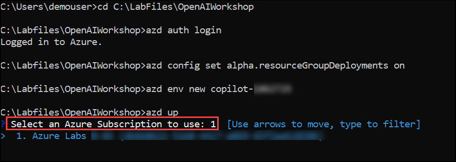

10. Please select an Azure location to use, select the location as **East US 2,** and click on the **Enter** button. You can change the location using the up and down arrows.

11. Next, select the **AzureAIrg** resource group and hit **ENTER**.

12. Once the deployment succeeds, you will see the following message: **SUCCESS: Your application was provisioned and deployed to Azure**. The deployment might take 5-10 minutes. It produces a web package file, then creates the resource and publishes the package for the app service.


13. Navigate back to the Azure portal, search, and select **App service**. Select the available web app that you have deployed in the previous step.

    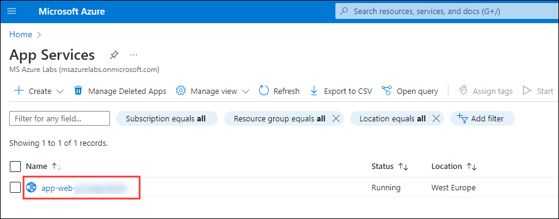

14. Next, click on **Browse** to open your web application.

    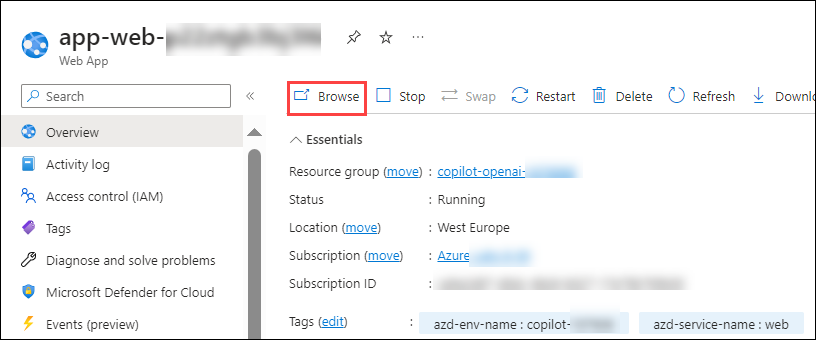

    

    > **Note**: If an issue occurs when you try to launch the app service, please restart the app service and wait five minutes before trying to launch the app again.

> **Congratulations** on completing the task! Now, it's time to validate it. Here are the steps:
> - Click on the **Validate** button for the corresponding task. If you receive a success message, you can proceed to the next task. 
> - If not, carefully read the error message and retry the step, following the instructions in the lab guide.
> - If you need any assistance, please contact us at **labs-support@spektrasystems.com**. We are available 24/7 to help you out.

<validation step="12473853-3f61-4a6f-b405-c90920ff2f42" />

## Summary

In this lab, you have built and tested an HR/Payroll copilot application locally by configuring and running it with Azure OpenAI and Cognitive Search settings. They then integrated Azure Cognitive Search by setting up data sources, indexes, and vector fields. Finally, they deployed the application to Azure, authenticated with Azure, and used deployment commands to provision resources and launch the app. The lab concluded with the successful deployment and verification of the application on Azure.

### You have successfully completed the lab. Click Next >> to move on to the next set of exercises.
