# Lab 11: Explore Microsoft Defender for Cloud

## Lab Scenario
In this lab, you will explore Microsoft Defender for Cloud and learn how Azure Secure Score can be used to improve your organization's security posture. NOTE: the Azure subscription provided by the Authorized Lab Hoster (ALH) limits access and may experience longer than normal delays.

## Lab Objectives

In this lab, you will complete the following tasks:

+ Task 1: Explore Microsoft Defender for Cloud
+ Task 2: How to enable/disable the various Microsoft Defender for Cloud plans

## Estimated Timing: 60 Minutes

## Architecture Diagram

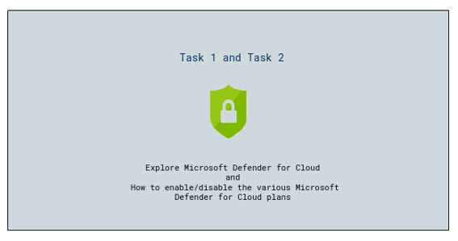

## Task 1: Explore Microsoft Defender for Cloud

1. In the Azure portal, in the **Search resources, services, and docs,** search for **Microsoft Defender for Cloud (1)**, then from the results list, select **Microsoft Defender for Cloud (2)**.

    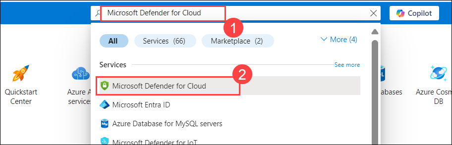

1. If this is the first time you enter Microsoft Defender for Cloud with your subscription, you may land on the Getting started page and be prompted to upgrade.  Scroll to the bottom of the page and select **Skip**. You'll be taken to the Overview page.

    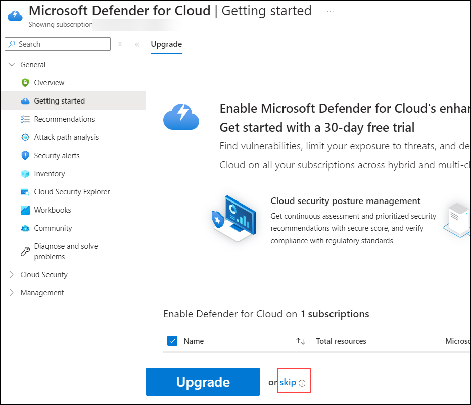
    
1. From the **Overview** page of Microsoft Defender for Cloud, notice the information available on the page (if you see 0 assessed resources and active recommendations, refresh the browser page. It may take a few minutes).  Information on the top of the page includes the number of Azure subscriptions, the number of Assessed resources, the number of active recommendations, and any security alerts.  On the main body of the page, there are cards representing Security posture, Regulatory compliance, Insights, and more.  Note: The Microsoft Defender for Cloud default policy initiative, which would normally have to be assigned by the admin, has already been assigned as part of the Azure subscription setup. The secure score, however, will show as 0% because Azure can have up to a 24-hour delay to reflect an initial score.
   
    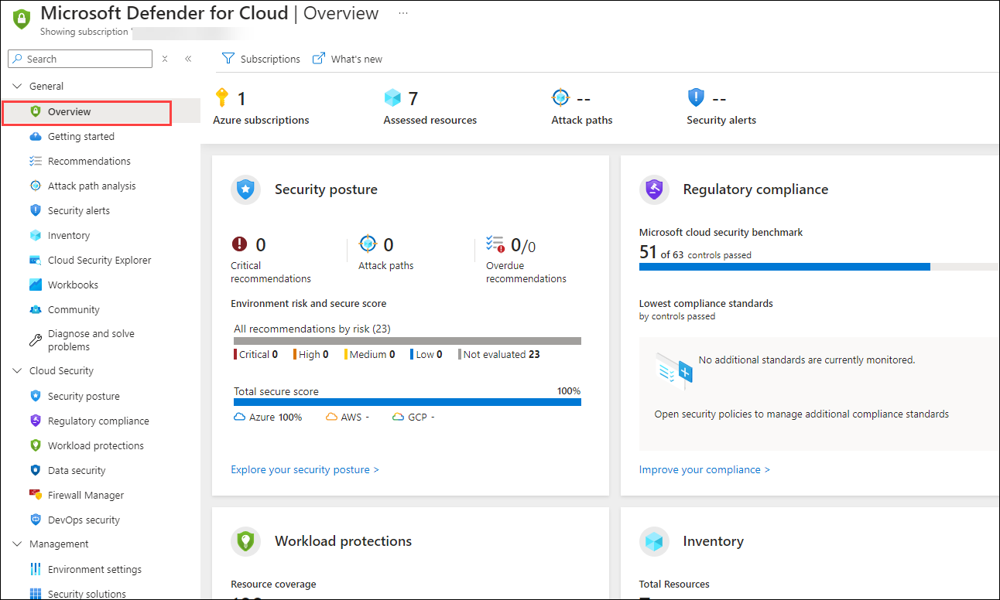   

1. From the top of the page, select **Assessed resources**.  (Note that this is equivalent to having selected Inventory from the left navigation panel of the Microsoft Defender for Cloud home page).

    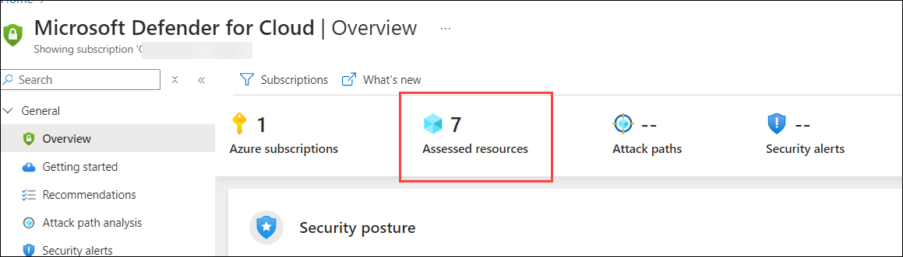
   
1. This brings you to the **Inventory** page, which lists the current resources. Select the virtual machine resource, **labvm-<inject key="DeploymentID" enableCopy="false"/>**. This resource is associated with the virtual machine you used in the previous lab.

    >**Important**: If you're unable to view any resources, please follow the steps below:

   - Navigate to  **Environment settings (1)** under the **Management** section. On the **Microsoft Defender for Cloud | Environment settings** page, select **Subscription (2)**

     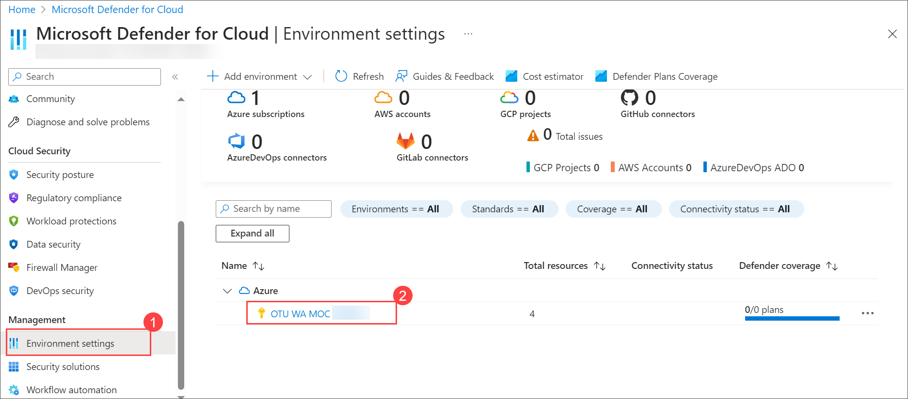
     
   - In the settings page, from the left navigation pane, choose **Security policies (1)** and enable the toggle for **Microsoft cloud security benchmark (2)**.
      
     .png)

   - Return to the Inventory page and refresh to view the resources.

     >**Note**: It will take around 1-1.5 hr to fetch all the resources inside the Inventory.

1. The Resource health page for the VM provides a list of recommendations.  From the available list, select any item that shows an **unhealthy** status.
   
      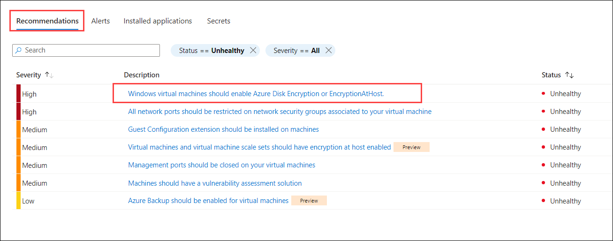

1. Click on **View recommendation for all resources** from the top menu.

    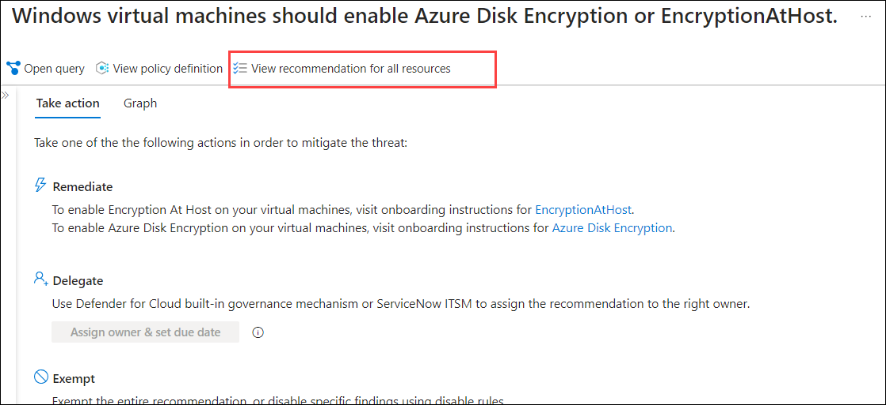
   
1. Note the detailed description. Select the drop-down arrow next to the Remediation steps. Note how remediation instructions (or links to instructions) are provided, along with the option to take action.  Exit the window without taking any action.

    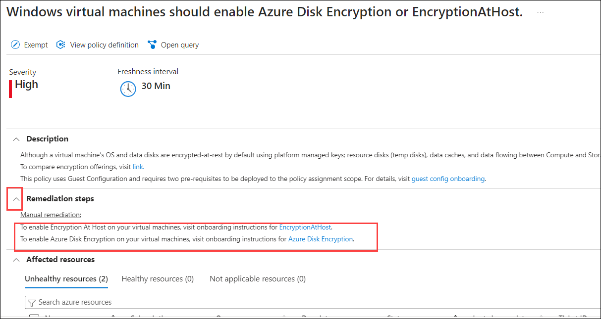
  
1. Return to the Microsoft Defender for Cloud overview page by selecting **Microsoft Defender for Cloud | Overview** from the top of the page, above where it says Resource health.

1. From the main left navigation panel, select **Regulatory compliance (2)** under **Cloud Security (1)**. 

    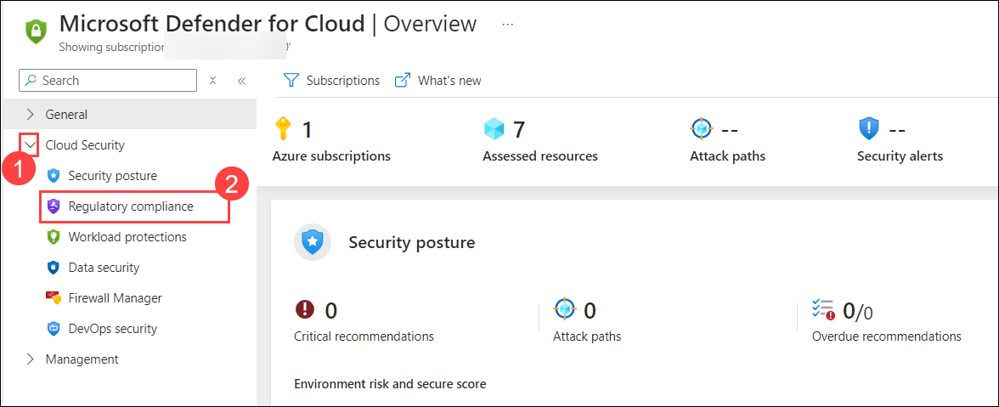

1. Alternatively, perform the below steps. 

1. Navigate to the **Manage Compliance Standards** from the top menu.

    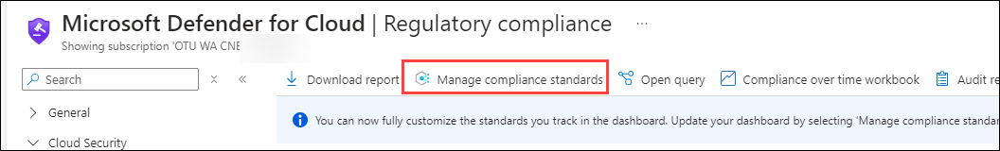

1. On the **Environment Settings page,** select **Subscription** (decrease the resolution if it isn't visible).

    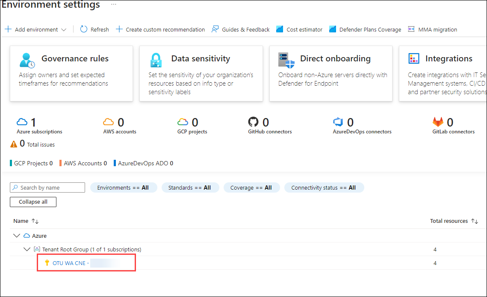

1.  On the Defender plans page, go to **Security policies** from the left navigation pane.

    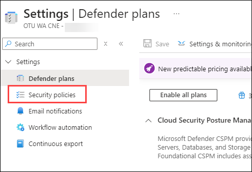

1. Against the **Microsoft cloud security benchmark,** click on the ellipsis **(...)(1)** and choose **View in Azure policy (2)**.     

    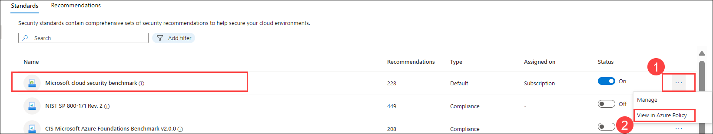

1. Click on **Assign**.

    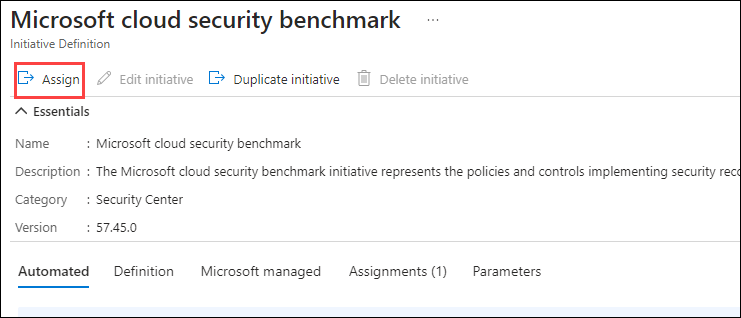

1. In the **Scope** option, select Azure subscription **(1),** then **Assignment name** as **Microsoft cloud security benchmark (2)** and leave remaining as default. Finally, select **Review + Create (3)**.

    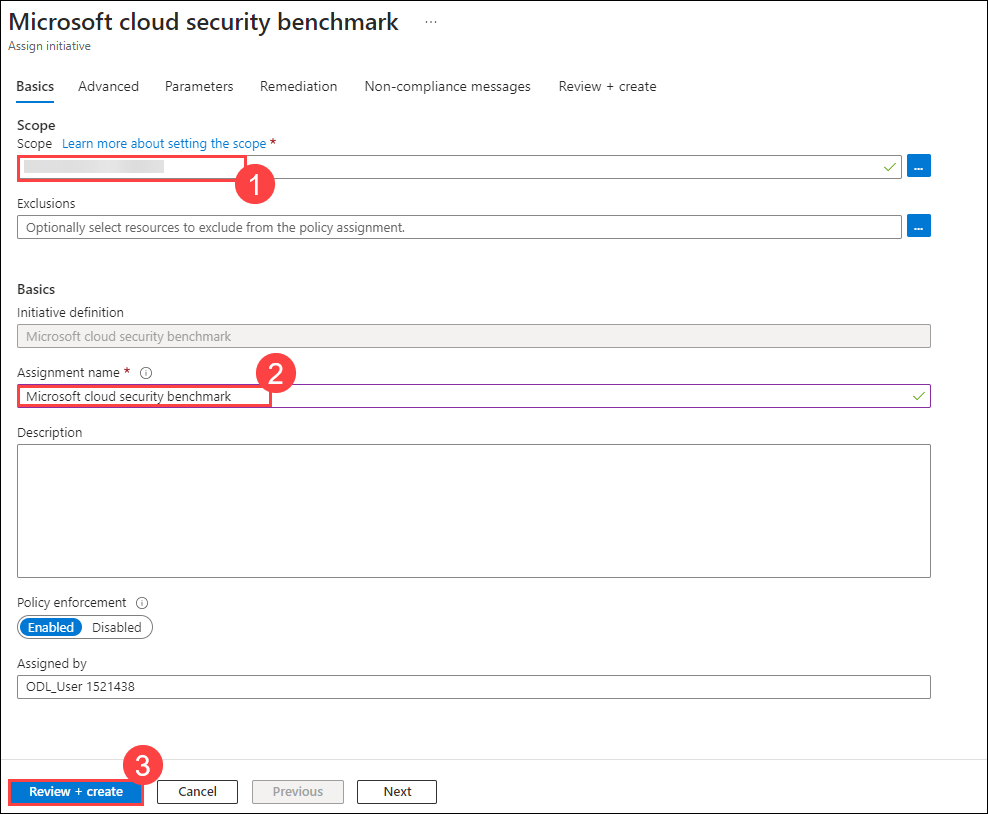

1. Click on **Create**.    

1. Let's explore one of the control domain areas. Select (expand) **NS. Network Security**. A list of controls related to network security is displayed.
       
   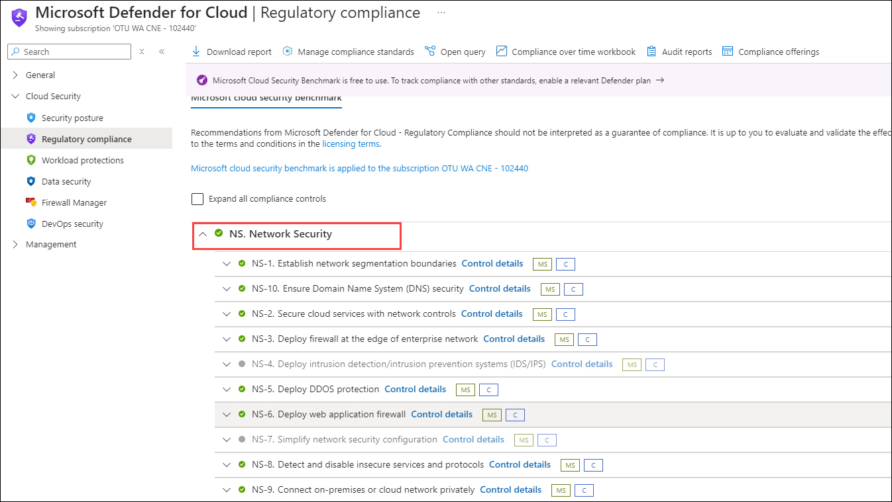
       
   >**Note**: If you are not able to see the list of controls as provided in the screenshot, skip the steps below and start Task 2.

1. It takes 2-3 hrs to fetch this list of controls.
   
1. Select any option from the list **(1)** and  note the list of **Automated assessments (2)** and how each assessment line item provides information, including the **Resource type **(3)**, failed resources **(4),** and compliance status (5)**. Select the assessments listed. Here, you will see information, including a description, remediation steps, and affected resources.

    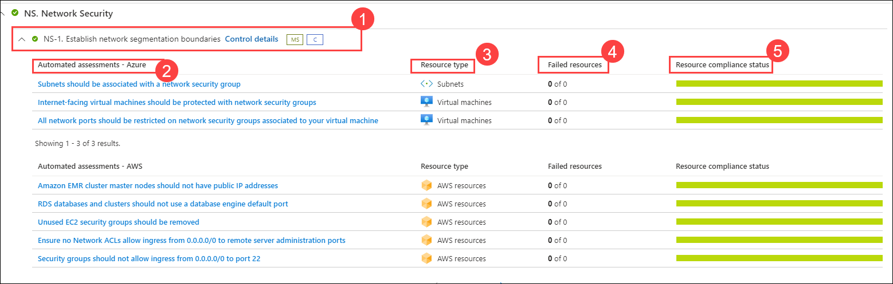
    
1. Select the **X** on the top-right corner of the screen to close the page.
   
1. Select **Overview** from the left navigation panel to  return to the Microsoft Defender for Cloud Overview page.
     
1. Keep the Microsoft Defender for Cloud overview page open. You will use in the next task.

> **Congratulations** on completing the task! Now, it's time to validate it. Here are the steps:
> - Click on the **Validate** button for the corresponding task. If you receive a success message, you can proceed to the next task. 
> - If not, carefully read the error message and retry the step, following the instructions in the lab guide.
> - If you need any assistance, please contact us at **labs-support@spektrasystems.com**. We are available 24/7 to help you out.

<validation step="5705918e-651e-428a-ac8f-4f4c41b83546" />

## Task 2: How to enable/disable the various Microsoft Defender for Cloud plans

Recall that Microsoft Defender for Cloud is offered in two modes: without enhanced security features (free) and with enhanced security features that are available through the Microsoft Defender for Cloud plans. In this task, you discover how to enable/disable the various Microsoft Defender for Cloud plans.

1. From the Microsoft Defender for Cloud overview page, select the **Environment settings** from the left navigation panel.

    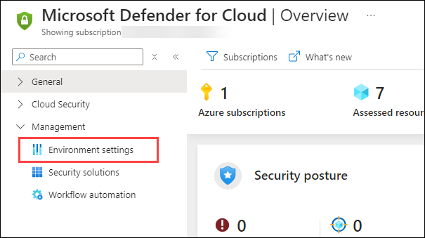

1. Expand the **Azure** list, **(1) Tenant Root Group (2),** then select the **Existing Subscription (3)** listed next to the yellow key icon.

   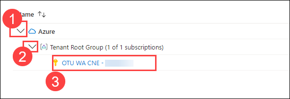
      
1. On the Defender plans page, notice how you can select Enable all or select individual Defender plans. 

1. Verify that Foundational CSPM status is set to **On**.  

1. On the Defender plans page, click on **Enable all plans (1)** and then select **Save (2)** from the top of the page.
   
   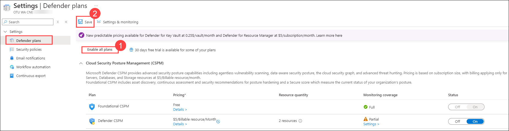

   >**Note:** On the **Plan selection** page, select **Microsoft Defender for APIs Plan 1**.
      
1. Close all the open browser tabs.
      
## Review
In this lab, you have completed:
- Explored on Microsoft Defender for Cloud
- Enabled/Disabled the various Microsoft Defender for Cloud plans

### You have successfully completed the lab. Click Next >> to move on to the next set of exercises.
