# Lab 12: Run Miyagi App Locally

## Lab Scenario

In this lab, the focus is on configuring the Miyagi App for operational readiness. Subsequently, attention shifts to understanding the nuanced implementation of the Recommendation service. The practical phase involves executing the Recommendation service and deploying the Miyagi frontend locally for testing and development. A crucial step includes optimizing data retrieval efficiency by persisting embeddings in Azure AI Search. The project culminates with a broader exploration of the Miyagi App and Recommendation service, emphasizing a personalized user experience. This task-based approach ensures a systematic progression through the project intricacies, facilitating a comprehensive understanding and effective implementation.

## Lab Objectives

You will be able to complete the following tasks:

- Task 1: Setup configuration for miyagi app
- Task 2: Understanding the implementation of the Recommendation service
- Task 3: Run recommendation service locally
- Task 4: Run miyagi frontend locally
- Task 5: Persist embeddings in Azure AI Search
- Task 6: Explore the Miyagi App and Recommendation service by Personalizing

### Estimated Duration: 40 minutes
  
### Task 1: Setup configuration for miyagi app

In this task, you will configure the Miyagi application by updating specific settings in Visual Studio Code. This involves replacing placeholder values in configuration files with the actual values for various Azure resources to ensure proper connectivity and functionality.

1. Navigate to the [Azure portal](https://portal.azure.com) and log in with your credentials. Then, select **Resource groups**. Select the **AzureAIrg** resource group.

   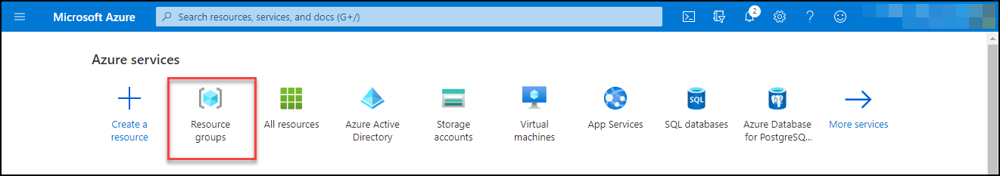

1. Select the **aiinadaystorage<inject key="DeploymentID" enableCopy="false"/>** Storage account.

   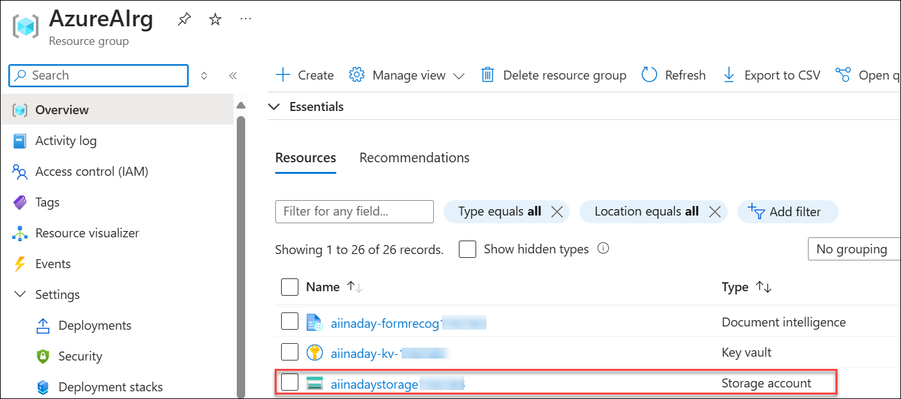

1. Under **Settings (1)**, navigate to the **Resource sharing (CORS) (2)** page. 

   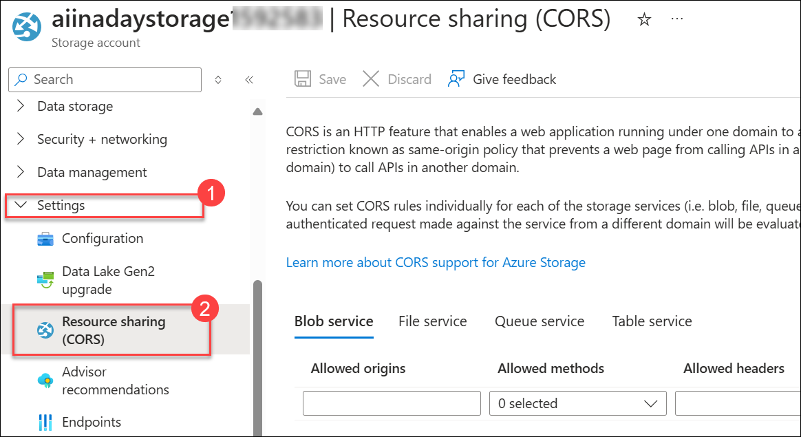
    
1. On the Resource Sharing (CORS) page, ensure that you are on the **Blob service** **(1)** tab, and enter the following values into the table **(2)** and then select **Save** **(3)** to save the CORS settings.  

   | Parameter                   | Value                                              |
   | --------------------------- | -------------------------------------------------- |
   | Allowed origins             | Enter `*` |
   | Allowed methods             | Select all of the available methods.               |
   | Allowed headers             | Enter `*`                                          |
   | Exposed headers             | Enter `*`                                          |
   | Max age                     | Enter `200`                                        |

    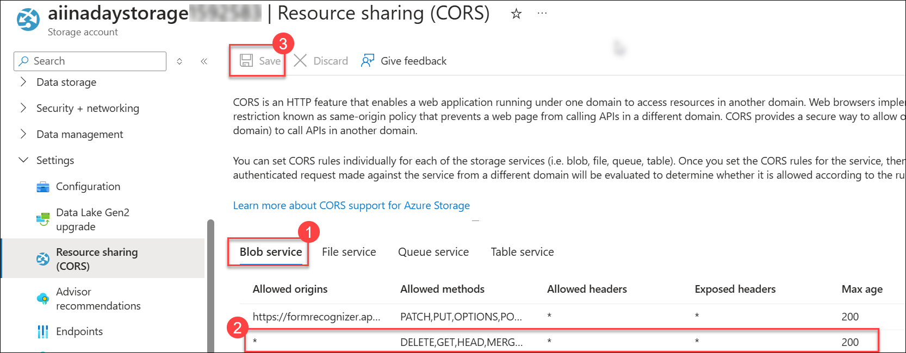
   
1. Open **Visual Studio Code** from the Lab VM desktop by double-clicking on it.

   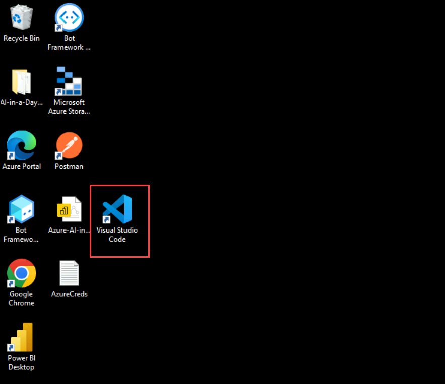

   >**Note** If **Join us in making promt-flow extension better!** window prompted please click on **No,thanks**.

   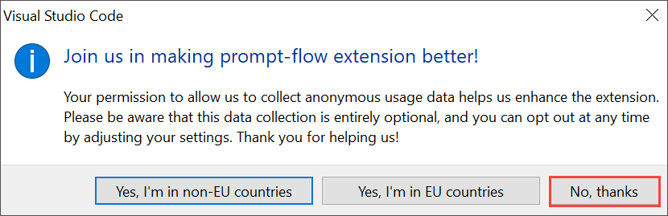
   
1. In **Visual Studio Code** from menu bar select **File(1)>open folder(2)**.

   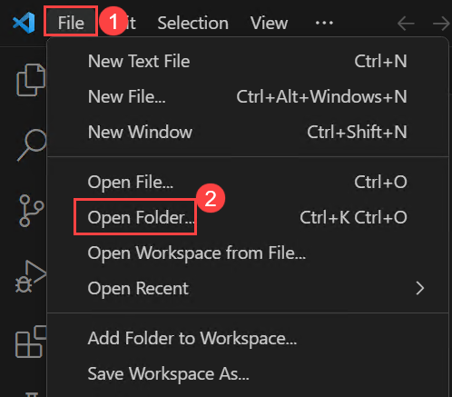

1. Within **File Explorer**, navigate to **C:\LabFiles\miyagi** select **miyagi**(1) click on **Select folder(2)**

   .png)

1. In **Visual Studio Code**, click on **Yes, I trust the authors** when **Do you trust the authors of the files in this folder?** window prompted.

   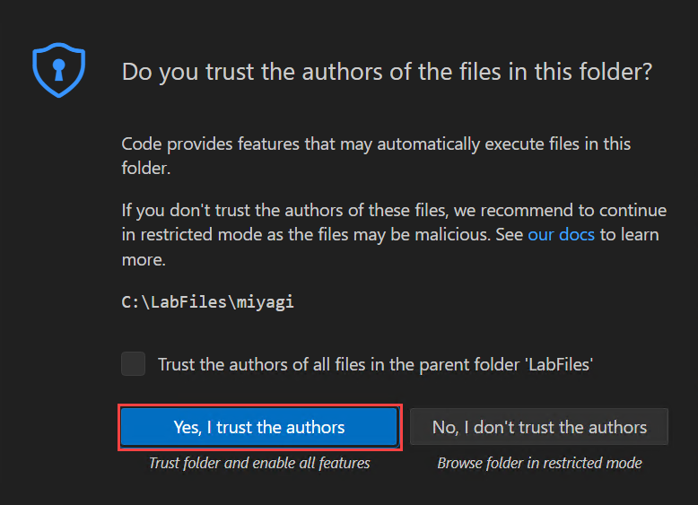 
   
1. Expand **miyagi>ui** directory and verify that **.env.** file is present. 

1. Expand **miyagi/services/recommendation-service/dotnet** directory and verify that **appsettings.json** file is present.

   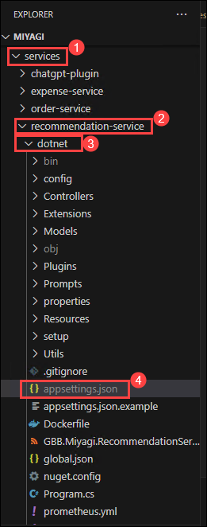
  
1. Open **appsettings.json** file and replace the following values for the variables below.

   | **Variables**                | **Values**                                                    |
   | ---------------------------- |---------------------------------------------------------------|
   | deploymentOrModelId          | **copilot-gpt**         |
   | embeddingDeploymentOrModelId | **CompletionModel**          |
   | endpoint                     | **Paste the OpenAI endpoint**          |
   | apiKey                       | **Paste the OpenAI key**               |
   | azureCognitiveSearchEndpoint | **Paste the azure search URL**        |
   | azureCognitiveSearchApiKey   | **Paste the azure search key**            |
   | cosmosDbUri                  | **<inject key="CosmosDBuri" enableCopy="true"/>**             |
   | blobServiceUri               | **<inject key="StorageAccounturi" enableCopy="true"/>**       |
   | bingApiKey                   | **<inject key="Bing_API_KEY" enableCopy="true"/>**           |
   | cosmosDbConnectionString     | **<inject key="CosmosDBconnectinString" enableCopy="true"/>** |
   
   > **Note**: FYI, the above values/Keys/Endpoints/ConnectionString of Azure Resources are directly injected to labguide. Leave default settings for "cosmosDbContainerName": "recommendations" and "logLevel": "Trace".

      1.png)
   
1. Once after updating the values kindly save the file by pressing **CTRL + S**.

1. Navigate to **miyagi/sandbox/usecases/rag/dotnet** and verify **.env** file is present.
  
1. In the **.env** file replace the following values for the variables below.

   | **Variables**                          | **Values**                                            |
   | ---------------------------------------| ------------------------------------------------------|
   | AZURE_OPENAI_ENDPOINT                  | **Paste the OpenAI endpoint**  |
   | AZURE_OPENAI_CHAT_MODEL                | **copilot-gpt** |
   | AZURE_OPENAI_EMBEDDING_MODEL           | **CompletionModel**  |
   | AZURE_OPENAI_API_KEY                   | **Paste the OpenAI key**       |
   | AZURE_COGNITIVE_SEARCH_ENDPOINT        | **Paste the azure search URL**|
   |AZURE_COGNITIVE_SEARCH_API_KEY          | **Paste the azure search key**    |
   
   .png)
   
1. Once after updating the values kindly save the file by pressing **CTRL + S**.

> **Congratulations** on completing the task! Now, it's time to validate it. Here are the steps:
> - Click on the **Validate** button for the corresponding task. If you receive a success message, you can proceed to the next task. 
> - If not, carefully read the error message and retry the step, following the instructions in the lab guide.
> - If you need any assistance, please contact us at **cloudlabs-support@spektrasystems.com**. We are available 24/7 to help you out.

<validation step="dbc75b3f-72c2-4228-9f4b-d6faf9bf3c14" />

### Task 2: Understanding the implementation of the Recommendation service

Recommendation service implements RAG pattern using Semantic Kernel SDK. The details of the implementation are captured in the Jupyter notebook in the folder miyagi/sandbox/usecases/rag/dotnet. You can open the notebook in VSCode and run the cells to understand step-by-step details of how the Recommendation Service is implemented. Pay special attention to how the RAG pattern is implemented using Semantic Kernel. Select kernel as .NET Interactive in the top right corner of the notebook.

<!-- 1. Click on the **Eclipse Button (1)** at the top of the screen, then select **Terminal (2)** from the dropdown menu, and click on **New Terminal (3)** to open a new terminal window.

   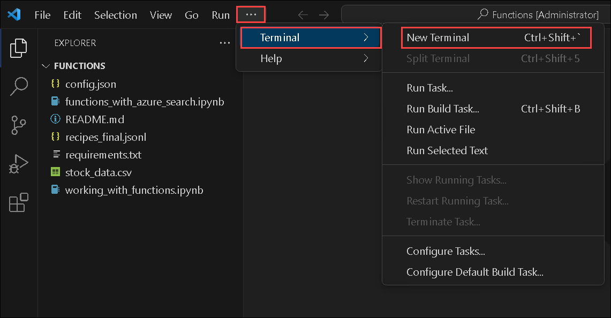

1. Now, run the below commands, for activating the polyglot:

   ```
   conda create -n polyglot_env python=3.9 -y
   
   conda activate polyglot_env
   
   conda install -c conda-forge polyglot
   
   curl -o node-setup.msi https://nodejs.org/dist/v18.17.1/node-v18.17.1-x64.msi
   
   Start-Process -FilePath node-setup.msi -ArgumentList '/quiet' -Wait
   ``` -->

1. In the Visual Studio Code navigate to **miyagi/sandbox/usecases/rag/dotnet** folder and select **Getting-started.ipynb**

   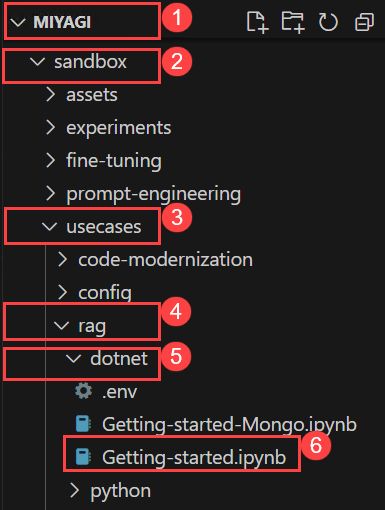

1. **Execute the notebook cell by cell** (using either Ctrl + Enter to stay on the same cell or Shift + Enter to move to the next cell), select the kernel as **.NET Interactive**, and observe the results of each cell execution.
  

   > **Note**: Make sure **.Net Interactive** is in ready State, if not please wait for 2 to 3 minutes. If it is still not loading, kindly close and reopen Visual Studio. Also, please do not click on **Run All** option to execute all the cells at a time which may lead to exceed in token limit that results Error: 503 – Service unreachable. 

      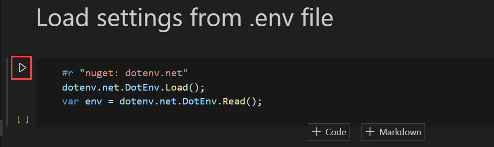
   
   > **Note**: Incase any issues or errors occur related to exceeding call rate limit of your current OpenAI S0 pricing tier. , Please wait for 15 to 20 seconds and Re-run the cell

> **Congratulations** on completing the task! Now, it's time to validate it. Here are the steps:
> - Click on the **Validate** button for the corresponding task. If you receive a success message, you can proceed to the next task. 
> - If not, carefully read the error message and retry the step, following the instructions in the lab guide.
> - If you need any assistance, please contact us at **cloudlabs-support@spektrasystems.com**. We are available 24/7 to help you out.

<validation step="3574d7d4-40d1-439b-bba0-7d1cbb1b45df" />

### Task 3: Run recommendation service locally
In this task, you will run the recommendation service locally by using Visual Studio Code to build and run the service in the terminal and then verify its functionality by accessing the Swagger page in the browser.

1. Open a new terminal: by navigating **miyagi/services/recommendation-service/dotnet** and right-click on **dotnet** in cascading menu select **Open in intergate Terminal**.

    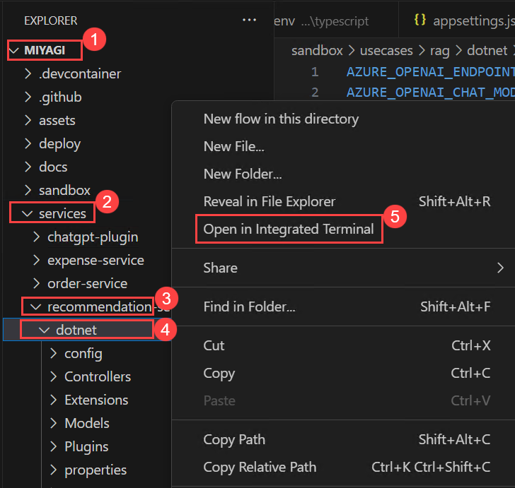

1. Run the following command to run the recommendation service locally
    
   ```
   dotnet build
   dotnet run
   ```

   > **Note**: Let the command run, meanwhile you can proceed with the next step.
   > **Note** The commands dotnet build and dotnet run are fundamental in .NET Core and .NET 5+ environments for building and running .NET applications locally on your machine.

1. Open another tab in Edge, in the browser window paste the following link

   ```
   http://localhost:5224/swagger/index.html 
   ```

   **Note**: Refresh the page continuously until you get the swagger page for the recommendation service as depicted in the image below.

   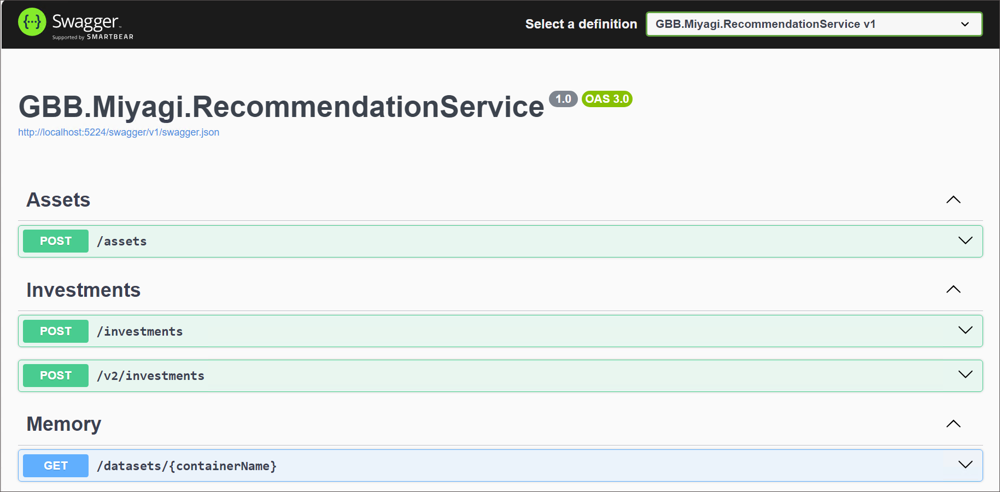


### Task 4: Run miyagi frontend locally
In this task, you will run the miyagi frontend locally by installing dependencies using npm and yarn, and then starting the development server. You will verify its functionality by accessing the local development server in the browser.

1. Open a new terminal: by navigating  **miyagi/ui** and right-click on **ui/typescript** , in cascading menu select **Open in intergate Terminal**.

   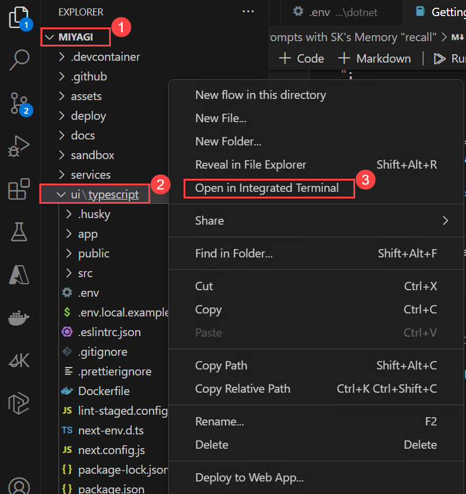

1. Run the following command to install the dependencies
   
    ```
    npm install --global yarn
    yarn install
    yarn dev
    ```

   > **Note**: Please wait till the command gets executed successfully. It will take up to 5 minutes. Once **yarn dev** command start executing wait for 2 mins and proceed with next step.
   
   > **Note**: These commands (npm install --global yarn, yarn install, and yarn dev) are indeed essential in JavaScript and TypeScript projects for managing dependencies and running scripts necessary to set up and run applications. They ensure that all required packages are installed (yarn install), and they execute development scripts (yarn dev) defined in the project's configuration (package.json).

1. Open a new tab in Edge, and browse the following

   ```
   http://localhost:4001
   ```

   >**Note:** You can get the port from the logs in the terminal.

      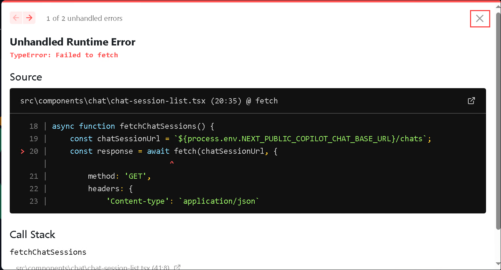

   >**Note:** If you encounter an **Unhandled Runtime Error** pop-up, close the pop-up and also dismiss the error message at the bottom left corner.

     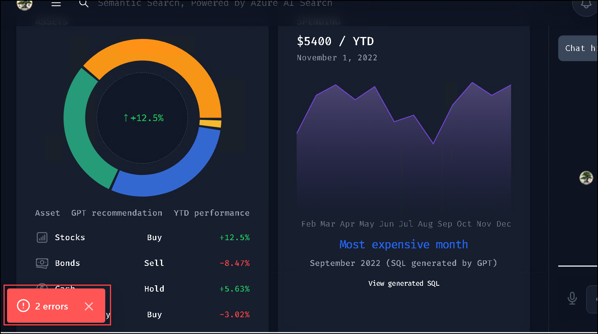
   

### Task 5: Persist embeddings in Azure AI Search

In this task, you will persist embeddings in Azure AI Search by executing a POST request in Swagger UI, verifying the execution, and then confirming the creation of the index in the Azure portal.

1. Navigate back to the **swagger UI** page, scroll to **Memory** session, click on **POST /dataset (1)** for expansion, and click on **Try it out (2)**.

   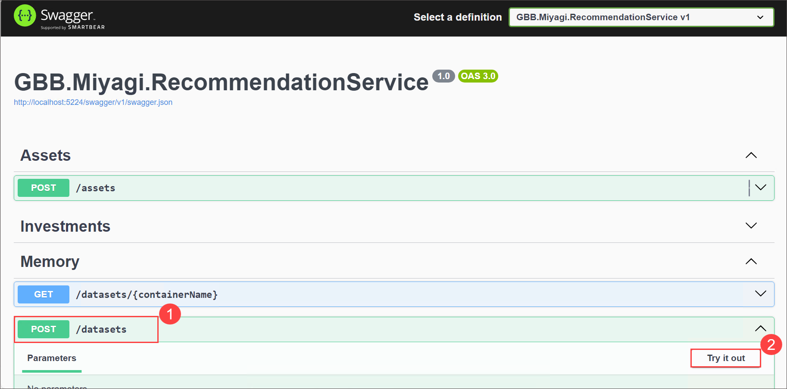

1. Replace the below **code (1)** with the below code, and click on **Execute (2)**.

     ```
     {
        "metadata": {
              "userId": "50",
              "riskLevel": "aggressive",
              "favoriteSubReddit": "finance",
              "favoriteAdvisor": "Jim Cramer"
            },
          "dataSetName": "intelligent-investor"
      }
      ```

     .png) 
      
1. In the **swagger UI** page, Scroll down to the **Responses** session review that it has been executed successfully by checking the code status is **200**.

    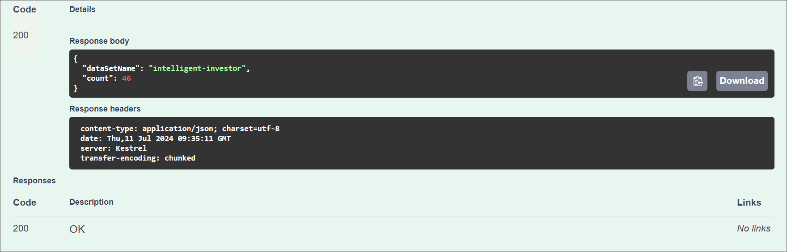

1. Navigate back to the **Azure portal** tab, in Search resources, services and docs (G+/) box at the top of the portal, enter **AI Search**, and then select **AI Search** under services.

    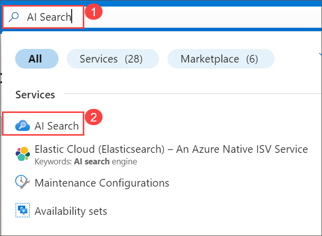

1. In **Azure AI services | AI Search** tab, select **aiinaday-cog-<inject key="DeploymentID" enableCopy="false"/>**.
   
1. In **aiinaday-cog-<inject key="DeploymentID" enableCopy="false"/>** Search service tab, click on **Indexes** **(1)** under Search management, and review the **miyagi-embeddings** **(2)** has been created.   

   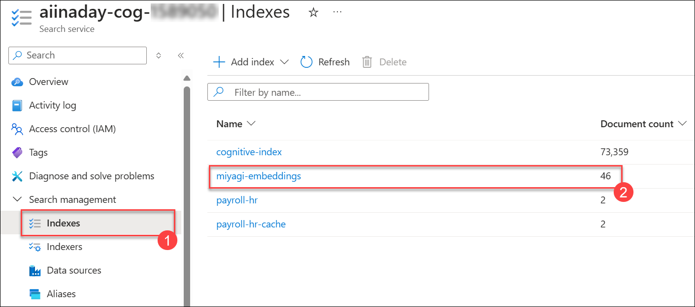

   > **Note**: Please click on the refresh button still you can view the **Document Count**.

> **Congratulations** on completing the task! Now, it's time to validate it. Here are the steps:
> - Click on the **Validate** button for the corresponding task. If you receive a success message, you can proceed to the next task. 
> - If not, carefully read the error message and retry the step, following the instructions in the lab guide.
> - If you need any assistance, please contact us at **cloudlabs-support@spektrasystems.com**. We are available 24/7 to help you out.

<validation step="d0ad746f-4b39-4ee2-9ee0-25f5de89e251" />

### Task 6: Explore the Miyagi App and Recommendation service  by Personalizing
In this task, you'll personalize the Miyagi App's Recommendation service by selecting a financial advisor and reviewing the recommendations. Then, you'll check the logs in Visual Studio Code and stop the services.

1. Navigate back to the **recommendation service** ui page, and click on **personalize** button.

    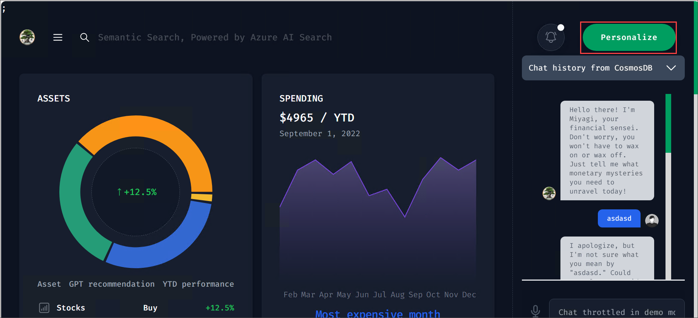

1. In the **Personalize** page, select your **Favorite Financial Advisor (1)** and choose **GPT-4 (2)** for the **Reasoning Engine** from the dropdown menu, then click on **Personalize (3)**.

   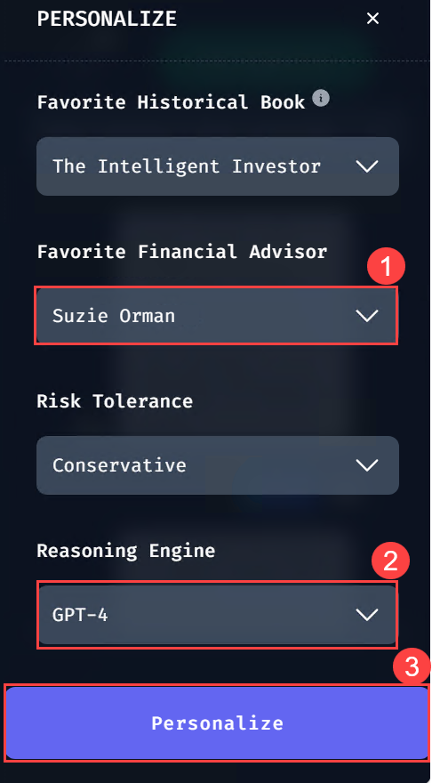

1. You should see the recommendations from the recommendation service in the Top Stocks widget.

   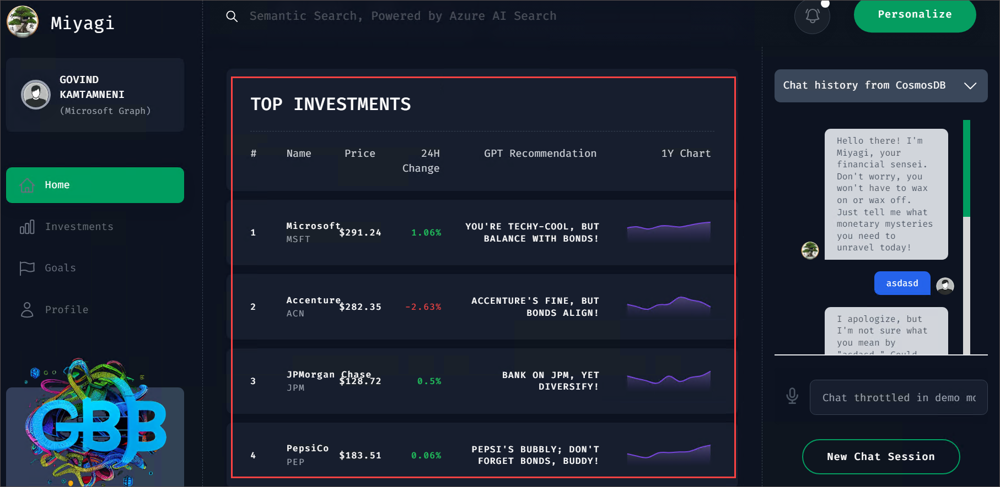 

1. Navigate to the **Visual Studio Code**, and click on **dotnet** from the terminal, you can go through the logs.

   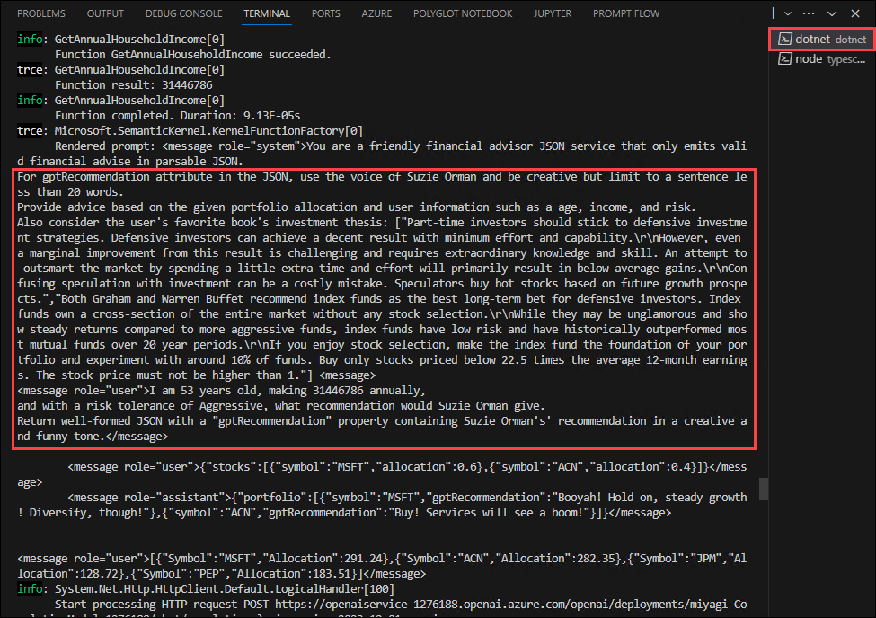    

1. Once you view the logs, press **Ctrl + C** to stop the **swagger UI** page.

1.  From the **Terminal** select **Node** terminal, press **Ctrl + C** to stop the **recommendation service** ui page.
      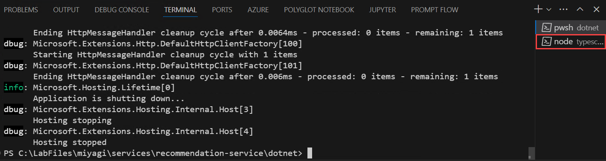

1. Close the terminal.

## Summary

In this Lab, you began with configuring the Miyagi App for operational readiness, followed by a detailed exploration of the Recommendation service's implementation. Practical execution involves running the Recommendation service and deploying the Miyagi frontend locally for testing. Enhancing data retrieval efficiency is a pivotal step, achieved by persisting embeddings in Azure AI Search. The project concludes with a broad exploration of the Miyagi App and Recommendation service, prioritizing a personalized user experience. This systematic approach ensures a thorough understanding and effective implementation throughout the project.

#### You have successfully completed this lab.