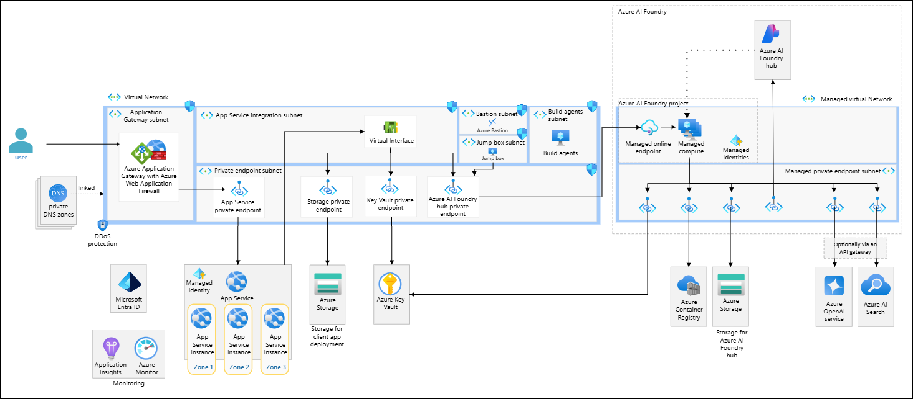
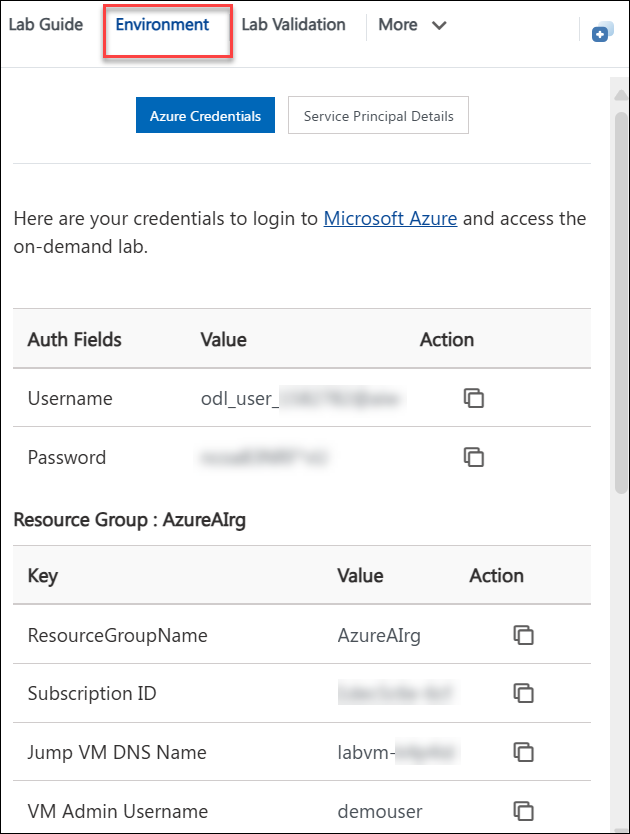
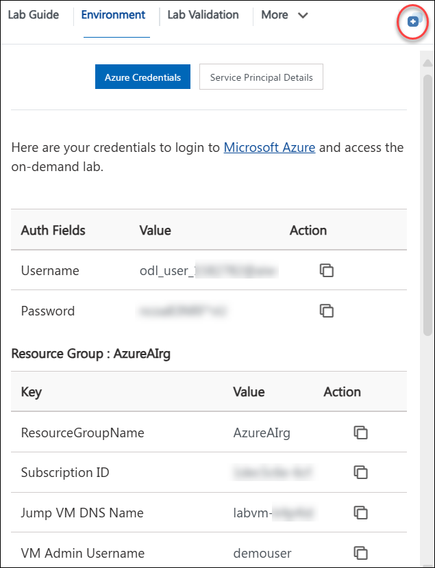
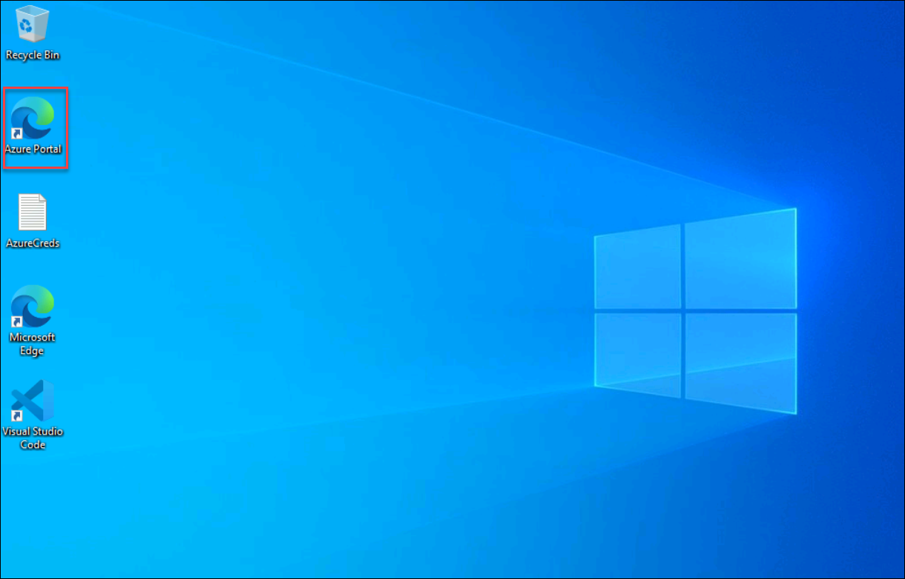

# Hands-on Lab: Conversational AI with Bot Service using Power Virtual Agents

### Overall Estimated Duration: 1 Hour

## Overview
The Hands-on Lab: Conversational AI with Bot Service using Power Virtual Agents introduces participants to building intelligent chatbots using Microsoft's Power Virtual Agents, a no-code/low-code tool. This lab guides users through creating conversational flows, integrating with external services using Power Automate, and enhancing the bot's functionality to address real-world scenarios. Participants will learn how to customize bots, implement AI-driven capabilities for natural language understanding, and deploy their bots across multiple channels like websites or Microsoft Teams. By the end of the lab, users will have a functional chatbot capable of delivering automated, dynamic responses to user queries.

## Objective

This session provides hands-on experience in creating and customizing intelligent chatbots using Microsoft Power Virtual Agents, leveraging its no-code interface. Participants will learn how to integrate chatbots with external services, enhance their functionality with AI-driven natural language understanding, and deploy them across various channels for practical, real-world applications.

- **Conversational AI with Bot Service using Power Virtual Agents** - Building conversational AI solutions with Power Virtual Agents and integrating them with other services.

## Pre-requisites

- Microsoft Account: Access to a Microsoft account with permissions to use Power Virtual Agents and Power Automate.
- Basic Understanding of Chatbots: Familiarity with the concept of chatbots and conversational AI.
- Access to Microsoft Power Platform: A valid subscription or trial for Power Virtual Agents and Power Automate.

## Architecture
The architecture for this lab series involves several key Azure services working together to provide a comprehensive AI and machine learning environment. The core components include Azure OpenAI Service for leveraging advanced language models, Azure Machine Learning for training and deploying machine learning models, and Azure Cognitive Services for adding capabilities like vision, speech, and language understanding. Additionally, Power Virtual Agents is used for building conversational AI, while Microsoft Defender for Cloud ensures security and compliance. The architecture also integrates Azure Storage for data management and Azure Functions for serverless computing, creating a robust and scalable AI solution.

## Architecture Diagram:

## Explanation of Components

1. **Azure OpenAI Service**: Utilized for advanced language models and natural language processing tasks.
2. **Azure Machine Learning**: Used for training, deploying, and managing machine learning models.
3. **Azure AI Services**: Provides capabilities like vision, speech, and language understanding.
4. **Power Virtual Agents**: Enables the creation of conversational AI and chatbots.
5. **Microsoft Defender for Cloud**: Ensures security and compliance across the cloud environment.
6. **Azure Storage**: Manages data storage needs.
7. **Azure Functions**: Facilitates serverless computing for scalable and efficient processing.

## Getting Started with the Lab
 
## Accessing Your Lab Environment
 
Once you're ready to dive in, your virtual machine and lab guide will be right at your fingertips within your web browser.

   

## Virtual Machine & Lab Guide
 
Your virtual machine is your workhorse throughout the workshop. The lab guide is your roadmap to success.
 
## Exploring Your Lab Resources
 
To get a better understanding of your lab resources and credentials, navigate to the **Environment** tab.
 
   
 
## Utilizing the Split Window Feature
 
For convenience, you can open the lab guide in a separate window by selecting the **Split Window** button from the Top right corner.
 
 
 
## Managing Your Virtual Machine
 
Feel free to start, stop, or restart your virtual machine as needed from the **Resources** tab. Your experience is in your hands!
 

## Lab Duration Extension

1. To extend the duration of the lab, kindly click the **Hourglass** icon in the top right corner of the lab environment. 

    

    >**Note:** You will get the **Hourglass** icon when 10 minutes are remaining in the lab.

2. Click **OK** to extend your lab duration.
 
   

3. If you have not extended the duration prior to when the lab is about to end, a pop-up will appear, giving you the option to extend. Click **OK** to proceed.

## Lab Guide Zoom In/Zoom Out

1. To adjust the zoom level for the environment page, click the **A↕ : 100%** icon located next to the timer in the lab environment.

   

## Let's Get Started with Azure Portal

1. On your virtual machine, click on the Azure Portal icon as shown below:

   
   
1. You'll see the **Sign into Microsoft Azure** tab. Here, enter your credentials:
 
   - **Email/Username:** <inject key="AzureAdUserEmail"></inject>
 
       
 
1. Next, provide your password:
 
   - **Password:** <inject key="AzureAdUserPassword"></inject>
 
       

1. If **Action required** pop-up window appears, click on **Ask later**.

   
    
1. If prompted to stay signed in, you can click **"No"**.
 
1. If a **Welcome to Microsoft Azure** pop-up window appears, simply click **"Cancel"** to skip the tour.

1. Click **"Next"** from the bottom right corner to embark on your Lab journey!

   .png)

This hands-on-lab will help you to gain insights on how Azure OpenAI’s content filtering mechanisms contribute to responsible AI deployment, and how you can leverage these filters to ensure that your AI models adhere to appropriate content standards.

## Support Contact

The CloudLabs support team is available 24/7, 365 days a year, via email and live chat to ensure seamless assistance at any time. We offer dedicated support channels tailored specifically for both learners and instructors, ensuring that all your needs are promptly and efficiently addressed.

Learner Support Contacts:

- Email Support: cloudlabs-support@spektrasystems.com
- Live Chat Support: https://cloudlabs.ai/labs-support

Now, click on Next from the lower right corner to move on to the next page.

## Happy Learning!!