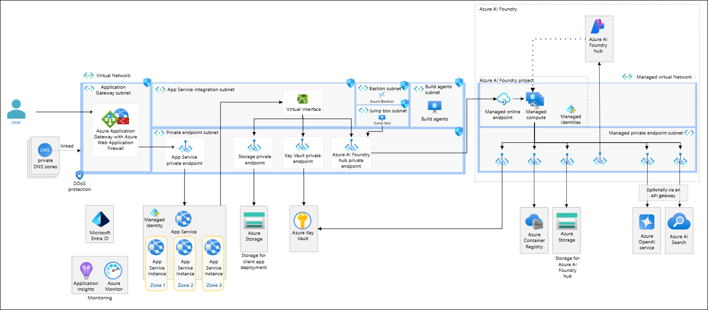
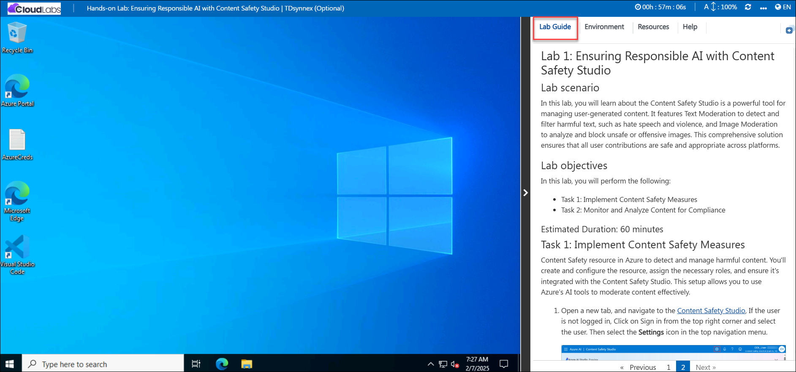
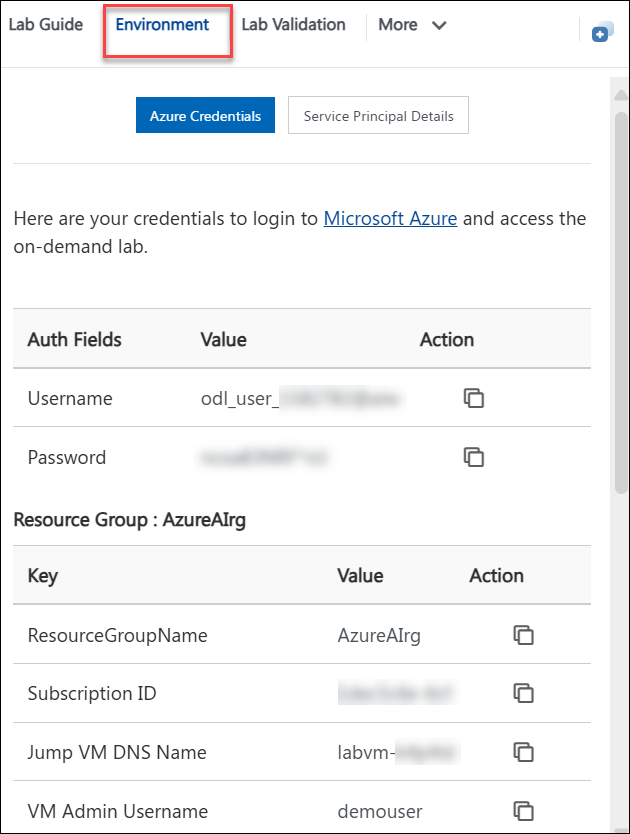
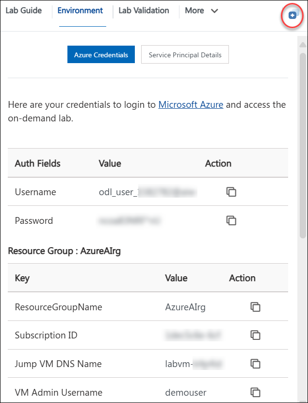
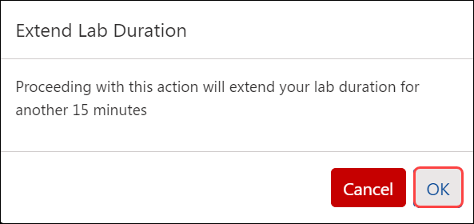
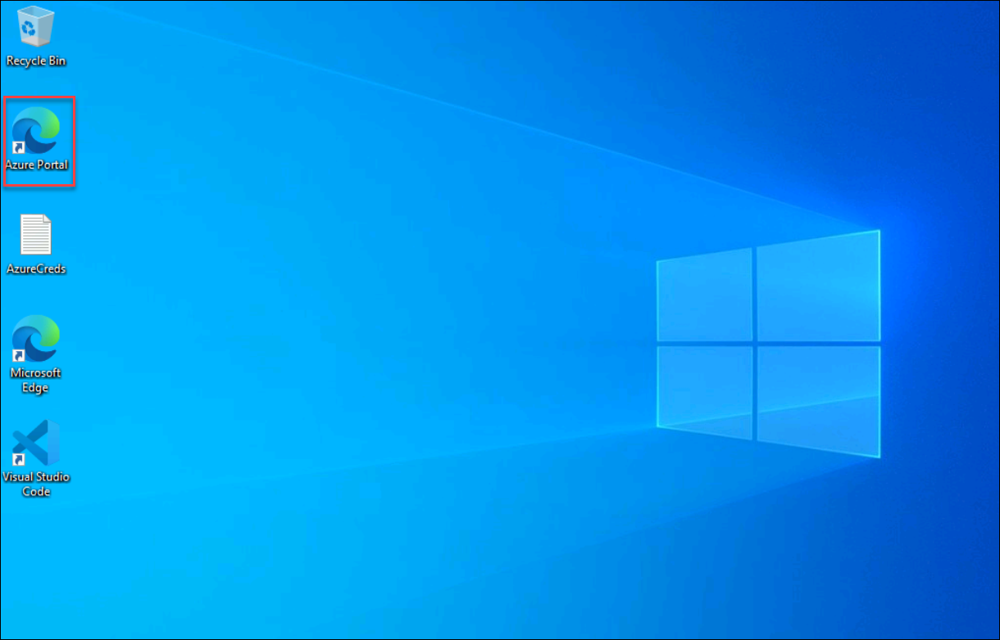

# Hands-on Lab: Ensuring Responsible AI with Content Safety Studio

### Overall Estimated Duration: 1 Hour

## Overview
The Hands-on Lab: Ensuring Responsible AI with Content Safety Studio provides participants with practical experience in leveraging AI tools to detect, manage, and mitigate harmful or unsafe content in applications. This lab focuses on implementing OpenAI’s content moderation tools to ensure ethical AI usage, including setting up the Content Safety Studio, configuring safety policies, and integrating content moderation pipelines into applications. By the end of the lab, participants will understand how to build responsible AI solutions that prioritize user safety, comply with ethical standards, and maintain platform integrity.

## Objective

This session provides hands-on experience with Azure AI services, guiding participants through the process of building, deploying, and managing AI solutions. By engaging with various labs, users will gain practical knowledge in areas such as natural language processing, machine learning model training, document processing, conversational AI, and ensuring responsible AI practices.

- **Ensuring Responsible AI with Content Safety Studio** - Ensuring responsible AI practices using Content Safety Studio to monitor and manage AI content.

## Pre-requisites

- Familiarity with Azure OpenAI Service.
- Familiarity with Azure Portal.
- Basic understanding of large language models and their applications.

## Architecture
The architecture for this lab series involves several key Azure services working together to provide a comprehensive AI and machine learning environment. The core components include Azure OpenAI Service for leveraging advanced language models, Azure Machine Learning for training and deploying machine learning models, and Azure Cognitive Services for adding capabilities like vision, speech, and language understanding. Additionally, Power Virtual Agents is used for building conversational AI, while Microsoft Defender for Cloud ensures security and compliance. The architecture also integrates Azure Storage for data management and Azure Functions for serverless computing, creating a robust and scalable AI solution.

## Architecture Diagram:

## Explanation of Components

1. **Azure OpenAI Service**: Utilized for advanced language models and natural language processing tasks.
2. **Azure Machine Learning**: Used for training, deploying, and managing machine learning models.
3. **Azure AI Services**: Provides capabilities like vision, speech, and language understanding.
4. **Power Virtual Agents**: Enables the creation of conversational AI and chatbots.
5. **Microsoft Defender for Cloud**: Ensures security and compliance across the cloud environment.
6. **Azure Storage**: Manages data storage needs.
7. **Azure Functions**: Facilitates serverless computing for scalable and efficient processing.

## Getting Started with the Lab
 
## Accessing Your Lab Environment
 
Once you're ready to dive in, your virtual machine and lab guide will be right at your fingertips within your web browser.

   

## Virtual Machine & Lab Guide
 
Your virtual machine is your workhorse throughout the workshop. The lab guide is your roadmap to success.
 
## Exploring Your Lab Resources
 
To get a better understanding of your lab resources and credentials, navigate to the **Environment** tab.
 
   
 
## Utilizing the Split Window Feature
 
For convenience, you can open the lab guide in a separate window by selecting the **Split Window** button from the Top right corner.
 
 
 
## Managing Your Virtual Machine
 
Feel free to start, stop, or restart your virtual machine as needed from the **Resources** tab. Your experience is in your hands!
 

## Lab Duration Extension

1. To extend the duration of the lab, kindly click the **Hourglass** icon in the top right corner of the lab environment. 

    

    >**Note:** You will get the **Hourglass** icon when 10 minutes are remaining in the lab.

2. Click **OK** to extend your lab duration.
 
   

3. If you have not extended the duration prior to when the lab is about to end, a pop-up will appear, giving you the option to extend. Click **OK** to proceed.

## Lab Guide Zoom In/Zoom Out

1. To adjust the zoom level for the environment page, click the **A↕ : 100%** icon located next to the timer in the lab environment.

   

## Let's Get Started with Azure Portal

1. On your virtual machine, click on the Azure Portal icon as shown below:

   
   
1. You'll see the **Sign into Microsoft Azure** tab. Here, enter your credentials:
 
   - **Email/Username:** <inject key="AzureAdUserEmail"></inject>
 
       
 
1. Next, provide your password:
 
   - **Password:** <inject key="AzureAdUserPassword"></inject>
 
       

1. If **Action required** pop-up window appears, click on **Ask later**.

   
    
1. If prompted to stay signed in, you can click **"No"**.
 
1. If a **Welcome to Microsoft Azure** pop-up window appears, simply click **"Cancel"** to skip the tour.

1. Click **"Next"** from the bottom right corner to embark on your Lab journey!

   .png)

This hands-on-lab will help you to gain insights on how Azure OpenAI’s content filtering mechanisms contribute to responsible AI deployment, and how you can leverage these filters to ensure that your AI models adhere to appropriate content standards.

## Support Contact

The CloudLabs support team is available 24/7, 365 days a year, via email and live chat to ensure seamless assistance at any time. We offer dedicated support channels tailored specifically for both learners and instructors, ensuring that all your needs are promptly and efficiently addressed.

Learner Support Contacts:

- Email Support: labs-support@spektrasystems.com
- Live Chat Support: https://cloudlabs.ai/labs-support

Now, click on Next from the lower right corner to move on to the next page.

## Happy Learning!!